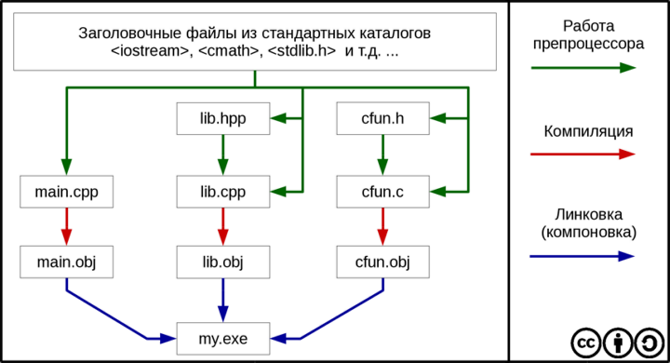

# Лекция 3


<a name="1">
## Многофайловая компоновка
</a>

 
Говорят, что переменная описана (определена), если она объявлена и под неё 
выделена память. Рассмотрим следующий пример, пусть в проекте есть два файла:

```cpp
/* a.cpp */
extern int n;    // "Где-то дальше определено"
void f(int);     // Предварительное объявление

void main() {
    n = 5; f(n);
}


/* b.cpp */
#include <iostream>
int i;           // Описание переменной

// Определение функции
void f(int i) {
    std::cout << i;
}
```
В C++ имеет место *независимая* компиляция: все файлы проекта компилируются 
независимо один от другого. Компиляция состоит из этапа собственно компиляции 
и этапа **линковки**.



<a name="2">
## Заголовочные файлы
</a>

 
Содержат заголовки всех функций и объявления переменных, обычно имеют 
расширение `*.h` (header). Теперь можно вынести объявления функций из всех 
файлов в один (заголовочный):

```cpp
/* myheader.h */
extern int n;
void f(int);

/* myheader.cpp */
#include <iostream>
int n;

void f(int i) {
    std::cout << i;
}


/* a.cpp */
#include "myheader.h"

void main() {
    n = 5; f(n);
}

/* b.cpp */
#include "myheader.h"

void makeZero() {
    n = 0;
}
```
Имена пользовательских заголовочных файлов в директиве `include` 
заключаются в двойные кавычки, а имена стандартных заголовочных файлов —
в угловые скобки. Стандартные заголовочные файлы расположены в `/INCLUDE`.
Поиск пользовательских файлов производится в текущем каталоге.

*Замечание*: inline-функции не сохраняются в исходном коде, так как больше не 
используются (а сразу встраиваются на место вызова). Чтобы воспользоваться 
такими функциями в другой единице компиляции, их нужно поместить в 
заголовочный файл.


<a name="3">
### Содержимое заголовочных файлов
</a>

 
Что может содержать заголовочный файл:

|                                 | Пример                                    |
|---------------------------------|-------------------------------------------|
| Определения типов               | `struct point { int x, y; };`             |
| Шаблоны типов                   | `template<class T> class V { /* ... */ }` |
| Описания функций                | `extern int strlen(const char*);`         |
| Определения встраиваемых функций| `inline char get() { return *p++; }`      |
| Описания данных                 | `extern int a;`                           |
| Определения констант            | `const float pi = 3.141593;`              |
| Перечисления                    | `enum bool { false, true };`              |
| Описания имен                   | `class Matrix;`                           |
| Команды включения файлов        | `#include <signal.h>`                     |
| Макроопределения                | `#define Case break;case`                 |
| Комментарии                     | `/* проверка на конец файла */`           |

В заголовочном файле никогда не должно быть:

|                                 | Пример                                    |
|---------------------------------|-------------------------------------------|
| Определений обычных функций     | `char get() { return *p++; }`             |
| Определений данных              | `int a;`                                  |
| Определений составных констант  | `const tb[i] = { /* ... */ };`            |


<a name="4">
## Глобальные описания в C++ и необходимость пространств имен
</a>

 
При простом определении глобальных сущностей они объединяются в глобальном пространстве имен. Для создания локального пространства имен используется ключевое слово **`namespace`**.

```cpp
namespace MyNamespace{
    ... // содержимое пространства имён: типы, функции, что-угодно…
}
```


<a name="5">
## Пространства имен и заголовочные файлы
</a>

 
Прототипы функций и глобальные переменные в заголовочных файлах, особенно в крупных проектах, необходимо заключать в пространства имен.

```cpp
/* header.h */
namespace MyNamespace{
    extern int n;
    void f();
}
```


<a name="6">
## Основные этапы сборки проекта
</a>

 
1. Препроцессирование.
2. Компиляция каждого `*.cpp`-файла в объектный код (файлы `*.obj` или `*.o`).
3. Линковка — сборка всех объектных файлов в один исполняемый
	(`*.exe` или `ELF`).

#### Ошибки во время линковки

* Одинаковые объявления в одном пространстве имен.
* Ошибки при использовании `#include "*.cpp"` (грубая ошибка).
* Отсутствие описания функции.
* Отсутствие `main()` во всех файлах проектах.
* Несколько объявлений `main()`.

#### Особенности линковки

* Константы имеют внутреннюю линковку.
* `inline`-функции «погибают» при компиляции.
