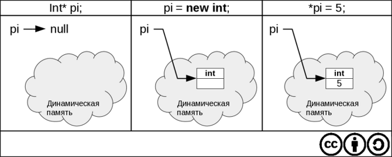
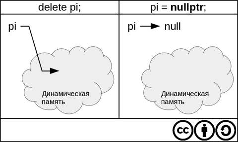
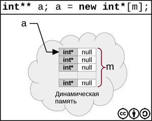
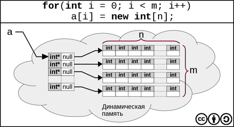

# Лекция 7


<a name="1">
## Стандартные функции для работы с C-строками
</a>

 
```cpp
#include <cstring>

// Возвращает длину строки p
size_t strlen(const char* p);

// Копирует строку q в строку p 
char* strcpy(char* destination, const char* source);
// Возвращает указатель на последний символ скопированной строки

// Сравнение строк в лексикографическом порядке
int strcmp(const char* s1, const char* s2);
// < 0, s1 < s2
// = 0, s1 == s2
// > 0, s1 > s2

// Добавляет source в конец destination
char* strcat (char* destination, const char* source);
// Считается, что в строке s1 достаточно памяти

// Ищет в строке s символ с
char* strchr(const char* s, char c);

// Ищет в строке s подстроку s1
char* strstr(const char* s, const char* s1);
```


<a name="2">
### Контроль памяти при работе с этими функциями
</a>

 
```cpp
char* s1 = "Hello";
char s1[];       // Указатель объявляется как неизменяемый
char* s2;

strcpy(s2, s1);  // Не работает, потому что память под s2 не выделена.

char s2[4];
strcpy(s2, s1);
```

Контроль памяти лежит на программисте. В случае возникновения ошибки она, 
по-началу, может себя никак не проявить.

Обычно такие опасные функции стараются не использовать. Вместо них применяют
аналогичные функции, контролирующие размер записываемых данных.

```cpp
char* s1 = "Hello";
char s2[4];
strncpy(s2, s1, 4);  // Защищает от переполнения
```


<a name="3">
## Указатели и динамическая память
</a>

 
В C/С++ динамическая память управляется с помощью указателей.

**Замечание.** В С++ сборщика мусора нет! Ответственность за 
выделение и освобождение памяти лежит на программисте.

Если необходимо в динамической памяти выделить место для `int`, используется
оператор `new`.

```cpp
int* pi = new int;

*pi = 5;
(*pi)++; // *pi == 6
```



Освобождение памяти производится с помощью оператора `delete`.

```cpp
delete pi;
pi = nullptr;  // Хороший стиль
```



Присваивание, указателю на высвобожденную память, значения `nullprt` защищает
от ошибки при повторном (ошибочном вызове) `delete`.


<a name="4">
### Ошибки при работе с динамической памятью
</a>

 
##### 1. Попытка разыменования нулевого указателя

```cpp
int *pi;
*pi = 5
```

##### 2. Утечка памяти

```cpp
int *pi = new int;
pi = new int;

// Особенно сильно это чувствуется при использовании в циклах
for(;;)
  pi = new int;
```

Если в процессе работы функции выделяется динамическая память, то ее следует
освобождать в теле той же функции. Если же указатель на динамически выделенную
память передается в качестве результата работы функции, то необходимо 
озаботиться об освобождении этой памяти вне тела этой функции. 
Такой принцип работы не всегда очевиден - тем и опасен.

```cpp
void f()
{
  int* pi = new int;
}
```

##### 3. Обращение к освобожденной памяти

```cpp
int *pi = new int;
*pi = 5
delete pi;
*pi = 6;
```


<a name="5">
## Массивы в динамической памяти(динамические массивы)
</a>

 
```cpp
int* pi new int[10]; // Выделение памяти для 10 элементов

pi[0] = 5;
pi[1] = 3;
...
```

Для возврата этой памяти используется оператор `delete[]`:

```cpp
delete[] pi;
```

**Примечание.** Обычно менеджер динамической памяти размещает в отрицательных
адресах массива размер выделенной памяти, однако использовать эту информацию,
скорее всего, не удастся.


<a name="6">
### Как передавать динамические массивы в функции
</a>

 
```cpp
void print(const int* pi, int size)
{
  for(int i = 0; i < n, i++)
    cout << pi[i] << ' ';
}

...

int* pi = new int[10];
print(pi, 10);
```


<a name="7">
## Двумерные динамические массивы 
</a>

 


<a name="8">
### Выделение памяти для статических массивов
</a>

 
```cpp
int a [3][4]; // размеры это константы, поскольку память должна выделяться
              // на этапе компиляции

void f(int a[][4], int m, int n)
{
  ...
}
```

Вообще говоря. так писать плохо. В таких случаях лучше использовать двумерные динамические массивы.


<a name="9">
### Выделение памяти для динамических массивов
</a>

 
```cpp
int** a; // a - указатель на начало массива из int*

int m, n;
cin >> m >> n; // Здесь размеры определяются на этапе выполнения программы
a = new int*[m];
```



Каждый элемент имеет тип `int*`  и значение `NULL`.

```cpp
for(int i = 0; i < m; i++)
  a[i] = new int[n];

// Теперь можно обращаться
a[1][2] ~ *(*(a+1)+2)
```




<a name="10">
### Передача двумерного динамического массива в функции
</a>

 
```cpp
void print(const int** a, int m, int n)
{
  for(int i = 0; i < m; i++)
  {
    for(int j = 0; i < n; j++)
      cout << a[i][j] << ' ';
    cout << endl;
  }
}
```

Двумерный **статический** массив в эту функцию передать нельзя.


**Замечание.** Динамические массивы позволяют задавать свой размер во время выполнения программы.


<a name="11">
### Возврат памяти
</a>

 
```cpp
for(int i = 0; i < m; i++)
  delete[] a[i];
delete[] a;
```


<a name="12">
## Динамические структуры данных
</a>

 
#### Линейный односвязный список

```cpp
struct node
{
  int dat;
  node* next;
  node(int data, node* next)
  {
    // this указатель на себя
    this->data=data;
    this->node=next;
  }
};
```
В С++ объект вызова конструктора не содержится в динамической памяти.

```cpp
node n1(4, nullptr);
```

Память под `n1` выделяется на стеке самой программы, а конструктор лишь инициализирует поля.

```cpp
node n2(3, &n1);
node n3(5, &n2);

node* p = &n3;
```


<a name="13">
## Шаблоны структур
</a>

 
Шаблоны впервые появились в C++, затем они перекочевали в  других языках программирования

```cpp
template<typename T>
struct node
{
  T dat;
  node<T>* next;
  node(T data, node<T>* next)
  {
    // this указатель на себя
    this->data=data;
    this->node=next;
  }
};
```

Теперь предыдущий пример будет выглядеть следующим образом:

```cpp
node<int> n1(4, nullptr);
node<int> n2(3, &n1);
node<int> n3(5, &n2);

node<int>* p = &n3;
```


