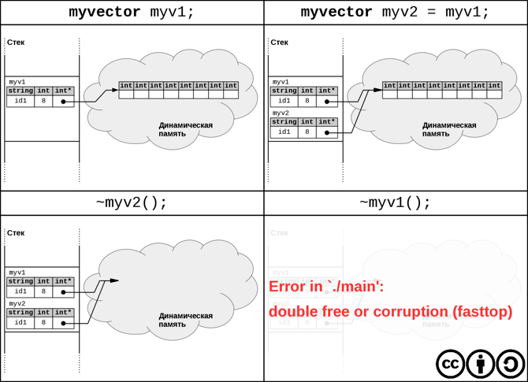

<!-- 
WARNING!!!
This file was generated automatically.
All changes made here will be erased.
-->

# Лекция 12


<a id="copy_constructor" title="Конструктор копии" class="toc-item"></a>
## Конструктор копии


Рассмотрим следующую реализацию класса `myvector`:

```cpp
class myvector {
    int size;
    int * data;
    string name;

public:
    myvector(string const & name = "id1")
        : size(10), name(name)
    {
        data = new int [size];
        cout << name << " created\n";
    }

    ~myvector()
    {
        delete [] data;
        cout << name << " killed\n";
    }
};
```

Проверим работу нашего класса, выполнив следующий код в функции `main`:

```cpp
    myvector myv1;
    myvector myv2 = myv1;
```

В строке `myvector myv2 = myv1;` мы подразумеваем, что происходит
копирование объекта `myv1`, а в конце выполнения функции `main()` —
удаление двух объектов: `myv1` и `myv2`.

В действительности, при запуске программы происходит ошибка:

> id1 created<br>
> id1 killed<br>
> *** Error in `./main': double free or corruption (fasttop): …


Данная проблема возникает из-за того, что команда `myvector myv2 = myv1;`
выполняет копирование указателя `data` объекта `myv1` в `myv2`. 
Таким образом в конце программы
одна и та же память освобождается дважды — в деструкторе каждого из объектов.



Для того, чтобы добиться корректного поведения при копировании, существует
так называемый **конструктор копии**. Это специальный конструктор, применяемый
для создания нового объекта как копии уже существующего.
Реализуем такой конструктор для класса `myvector`:

```cpp
myvector(myvector const & other): size(other.size), name(other.name)
{
    data = new int[size];
    copy(other.data, other.data + size, data);
    ++name[2];

    cout << "copy ctor from " << other.name << " to " << name << endl;
}
```

Теперь вывод программы выглядит следующим образом:

> id1 created<br>
> copy ctor from id1 to id2<br>
> id2 killed<br>
> id1 killed<br>


<a id="three_cases_calling_copy_constructor" title="Три случая когда вызывается конструктор копий" class="toc-item"></a>
### Три случая когда вызывается конструктор копий


1. Явное создание нового объекта-копии:

    ```cpp
    myvector myv2 = myv1`;
    ```

2. Вызов функции с передачей параметра **по значению**:

    ```cpp
    void f(myvector st) {/* … */}
    ```

3. Возврат объекта из функции по значению:

    ```cpp
    myvector g() {/* … */}
    ```


<a id="return_value_optimization" title="Return Value Optimization" class="toc-item"></a>
### Return Value Optimization


Рассмотрим следующий код.

```cpp
class myvector {
    …
public:
};

myvector g() { return myvector(); }

int main()
{ 
    myvector myv1 = g();
}
```

Вопрос: сколько будет вызвано конструкторов копий?
Ответ: здесь присутствуют случаи 1 и 3 вызова конструктора копий, а значит
должны создаваться две копии.

На самом деле, запуск данного примера покажет, что во время выполнения
программы не будет вызвано ни одного конструктора копий. Это результат
работы оптимизирующего компилятора. Заметим, что такая оптимизация может
существенно повлиять на поведение программы в случае,
когда конструктор копии содержит побочные эффекты (как в нашем примере:
вывод на консоль). Однако она производится
подавляющим большинством современных компиляторов _по умолчанию_,
потому что явно оговорена в стандарте языка.

Эта оптимизация носит название **Return Value Optimization (RVO)**.

Если специальными ключами компиляции запретить RVO, то будут вызвано
ровно два конструктора копии, как и ожидалось. Однако в реальных программах
просто стараются не помещать дополнительный код в
конструктор копии.


<a id="member_funcs_generated_silently" title="Функции-члены, которые генерируются «молча»" class="toc-item"></a>
## Функции-члены, которые генерируются «молча»


Рассмотрим следующий (не очень полезный) класс.

```cpp
class Empty {};
```

На самом деле, такое описание класса **эквивалентно** следующему:

```cpp
class Empty{
public:
    Empty() {}

    Empty(Empty const &) {/* … */}

    Empty & operator=(Empty const &) {/* … */}

    ~Empty() {/* … */}
};
```

Здесь присутствуют 4 функции:

* `Empty()` ― конструктор без параметров,
* `Empty(Empty const &)` ― конструктор копий,
* `Empty & operator=(Empty const &)` ― операция копирующего присваивания,
* `~Empty()` ― деструктор.

Четыре перечисленные функции генерируются автоматически. Деструктор и 
конструктор копии мы уже изучили, рассмотрим оставшиеся две.


<a id="default_constructor" title="Конструктор по-умолчанию" class="toc-item"></a>
## Конструктор по-умолчанию


Конструктор по-умолчанию — это конструктор без параметров, который
генерируется автоматически, только тогда, кода явно не определено ни одного
другого конструктора в классе (в том числе, конструктора копии).

Это свойство конструктора по-умолчанию может стать причиной неочевидных ошибок. 
Рассмотрим класс `Student` и создание объекта этого класса:

```cpp
class Student
{
    string name;
}

main()
{
    Student s;
}
```

Этот код компилируется и работает (хотя не очень полезен). В `main`
работает конструктор по умолчанию. Добавим в класс `Student` конструктор с 
инициализацией поля.

```cpp
class Student
{
    string name;
public:
    Student(string const & name) : name(name) {}
}
```

После этого `main` перестанет компилироваться, потому что исчезнет
конструктор по умолчанию. Аналогичная ошибка возникнет и при попытке объявить 
массив объектов класса `Student`:

```cpp
main()
{
    Student students[3];
}
```

Это происходит потому, что при создании массива объектов компилятор
вставляет вызовы конструктора без параметров для каждого элемента
массива. Чтобы такой массив можно было создать, нужно самому добавить
в класс конструктор без параметров, либо проводить инициализацию явно:

```cpp
main()
{
    Student students[] = {Student("Vasya"), Student("Petya"),
                                Student("Sasha")};
}
```


<a id="copy_assignment_operator" title="Операция копирующего присваивания" class="toc-item"></a>
## Операция копирующего присваивания


Сгенерированная компилятором реализация функции-члена `operator=` класса `myvector` 
аналогична сгенерированному конструктору копии, который привёл нас к ошибке
двойного освобождения памяти.

```cpp
    myvector myv1;
    myvector myv2;
    myv2 = myv1;
```

Здесь произойдёт ещё и утечка памяти, так как старое значение указателя `data` 
в объекте `myv2` потеряется. Значит, необходимо определить `operator=` самому.

```cpp
myvector & operator=(myvector const & other)
{
    if (this != &other) {   // Обязательное клише
        delete [] data;     // Нам потребуется новый размер поля data

        size = other.size;
        data = new int[size];
        copy(other.data, other.data + size, data);
        name = other.name;
        ++name[2];
    }

    return *this;
}
```

Данная реализация далека от идеала. В частности, могут возникнуть
проблемы при возникновении исключения в операции `new` (такое исключюение это 
не такая уж редкая ситуация): из-за `delete [] data` объект после
исключения в `new` останется в «полуразрушенном» состоянии. В C++
выделяют три уровня гарантий безопасности кода при возникновении исключений:

1. Базовая гарантия: при возникновении исключения не возникает утечек
   ресурсов, однако объекты могут находиться в непредсказуемом состоянии.

2. Сильная гарантия: если во время операции произошло исключение, то
   объект будет находиться в том же состоянии, что до начала операции.

3. Без исключений: в данном коде не может возникнуть исключений.

Приведённая версия `operator=` даёт лишь базовую гарантию. Достаточно
несложно изменить её на строгую. Заведём переменную `newdata` для
результата `new`, а операцию удаления `data` перенесём в конец функции.

```cpp
myvector & operator=(myvector const & other)
{
    if (this != &other) {
        size = other.size;
        int * newdata = new int[size];
        copy(other.data, other.data + size, data);
        name = other.name;
        ++name[2];

        delete [] data;
        data = newdata;
    }

    return *this;
}
```


<a id="copy_and_swap_idiom" title="Идиома copy-and-swap" class="toc-item"></a>
### Идиома copy-and-swap


Идиома **copy-and-swap** позволяет разрабатывать устойчивые к исключениям операторы присваивания и сокращает количество кода в них ценой определения полезной
вспомогательной функции `swap` (обмен содержимого двух объектов).

Заметим, что реализация `operator=`, приведённая выше (обе версии),
выполняет действия, которые мы уже делали раньше в разных местах программы,
а именно в деструкторе и в конструкторе копии. Идиома **copy-and-swap**
опирается на это наблюдение и предполагает реализацию операции копирующего
присваивания с использованием конструктора копий. При этом требуется
вначале создать вспомогательную функцию-члена `swap(myvector & other)`,
для обмена содержимого текущего объекта с объектом `other`.

```cpp
class myvector {
    …
public:
    myvector & operator=(myvector other)
    {
        this -> swap(other);

        cout << "copy assigment" << endl;
        return *this;
    }

    void swap(myvector & other)
    {
        std::swap(data, other.data);
        std::swap(size, other.size);
        std::swap(name, other.name);
    }
};
```

