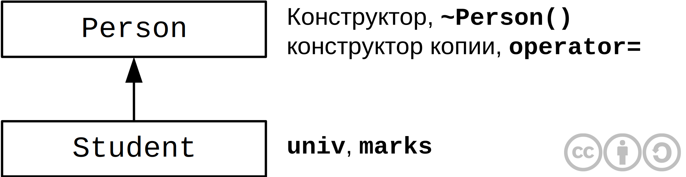
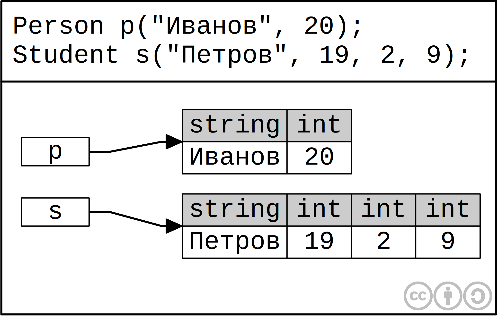
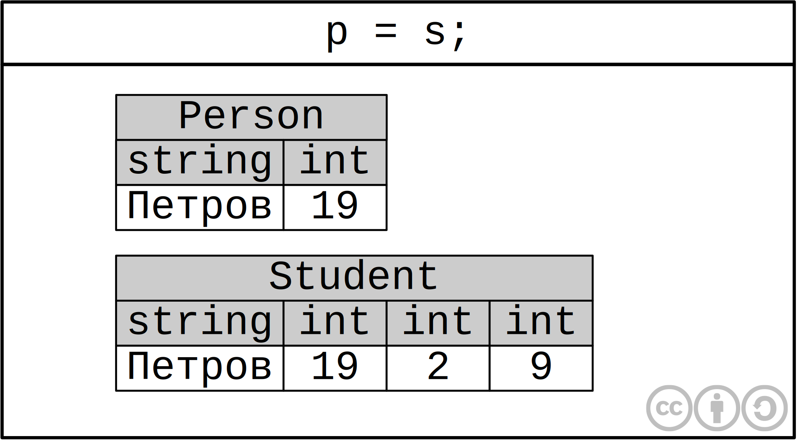
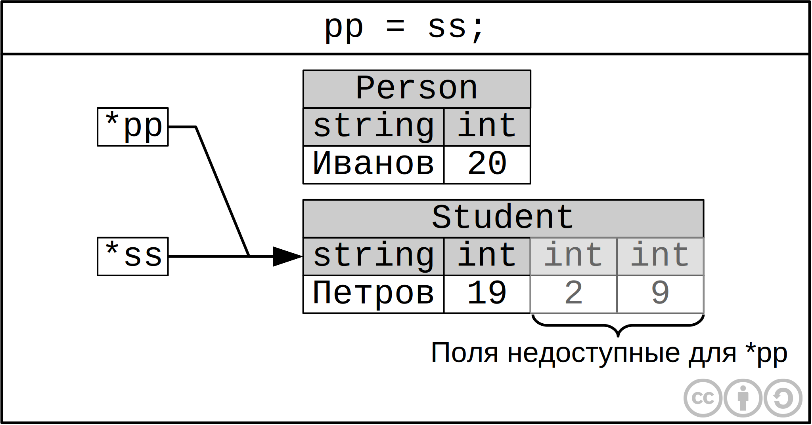

<!-- 
WARNING!!!
This file was generated automatically.
All changes made here will be erased.
-->

<script type="text/javascript">var last_page = true</script>

# Лекция 15


<a id="overloading_io" title="Перегрузка операций ввода-вывода" class="toc-item"></a>
## Перегрузка операций ввода-вывода


Займемся явной перегрузкой операции `operator<<()` для класса `frac`. В C++ в отличие от **.NET** перегружать нужно `operator<<()`, а не функцию преобразования класса к строке.

```cpp
class frac
{
	int m, n;
public:
	friend ostream& operator<<(ostream& os, const frac& f)
	{
		return os << '(' << f.m << ',' << f.n << ')';
	}
};
```


<a id="inheritance" title="Наследование" class="toc-item"></a>
## Наследование


Наследование используется для повторного использования ранее написанного кода.

Рассмотрим уже знакомую нам иерархию:



Наличие динамически выделяемой памяти `int* marks` в классе Student создает большое количество проблем. Рассмотрим подробнее:

```cpp
class Student: public Person
{
	string univ;	// Университет
	int* marks;		// Оценки
public:
	Student(const string& name, int age, const string& u, int pl, int ip, int ml) : Person(name, age), univ(u)
	{
		marks = newint[3];
		marks[0] = pl;
		marks[1] = ip;
		marks[2] = ml;
	}
	
	~Student() {delete[] marks;}
};
``` 

Здесь `Person(name, age)` - это вызов конструктора предка.
Если не написать вызов Person(name, age), то произойдет вызов конструктора по умолчанию, а если его нет произойдет ошибка.

В деструкторе нам необходимо освободить только память занимемую `marks` - память выделенная для `univ` и `Person` будет освобожденна автоматический при вызове соответствующих деструкторов в эпилоге деструктора `~Student`.


<a id="order_of_constructor_and_destructor_calls" title="Порядок вызова конструкторов и деструкторов" class="toc-item"></a>
## Порядок вызова конструкторов и деструкторов


1. Вызов конструктора базового класса
2. Вызов конструктора копии полей
3. Вызов конструктора основного объекта
4. Вызов деструктора базового класса
5. Вызов деструкторов полей
6. Вызов деструктора предка

Этот порядок не изменится если поменять местами элементы списка инициализации `Person(name, age)` и `univ(u)`

Все это происходит в эпилоге предка

Теперь нам необходимо написать конструктор копии класса `Student` 

```cpp
Student(const Student& s) : Person(s), univ(s.univ)
{
	marks = new int[3];
	std::copy(s.maks, s.marks + 3, marks);
}
```

Заметим, что `Person(s)` будет работать корректно благодаря **up-cast**

Операция присваивания будет реализована несколько сложнее:

```cpp
Student& operator=(const Student& s)
{
	if(&s != this)
	{
		delete[] marks;
		Person::operator=(s);
		marks = new int[3];
		std::copy(s.marks, s.marks + 3, marks);
		univ = s.univ;
	}
	returm *this;
};
```

Каждый ресурс под который выделяется память в конструкторе обычно стремятся обернуть объектом класса контролирующим этот ресурс, что упрощает код.

В `int* marks` выделение памяти происходит вручную, а для автоматического выделения памяти необходимо использовать `vector<int> marks`.

Теперь код становится значительно проще:

```cpp
class Student: public Person
{
	string univ;		// Университет
	vector<int> marks;	// Оценки
public:
	Student(const string& name, int age, const string& u, int pl, int ip, int ml) : Person(name, age), univ(u), marks(3)
	{
		marks[0] = pl;
		marks[1] = ip;
		marks[2] = ml;
	}
};
```

Деструктор теперь писать не надо так как автоматически сгенерируется `~Student()`, который вызовет `~marks`, `~uvin` и `~Person`.
Конструктор копии класса вызовет конструктор копии предка, а так же конструкторы копии полей класса.
**`operator=`** вызовет **`operator=`** предка и **`operator=`** для всех полей класса.
И все это будет происходить автоматически.

**Вывод.** Старайтесь все динамически выделяемые ресурсы оборачивать в отдельные классы


<a id="transformation_in_hierarchy_parent_child" title="Преобразование в иерархии "предок-потомок"" class="toc-item"></a>
## Преобразование в иерархии "предок-потомок"


```cpp
Person p("Иванов", 20);
Student s("Петров", 19, 2, 9);

p = s;
s = p;
```

Здесь работает **правило:** переменной типа предок можно присвоить переменную типа потомок, но не наоборот.
Следовательно `s = p;` не будет выполнено.



При присваивании объекта произв класса переменной базового класса происходит обрезание полей произв класса до полей базового класса. То есть произойдет копирование только полей связанных с персоной.



<br><br>

Теперь рассмотрим преобразование типов при работе с указателями.

```cpp
Person* pp = &p;
Student* ss = &s;
```


Возникает вопрос, возможны ли в данном случае следующие операции:

```cpp
pp = ss;
ss = pp;
```

Ответ: `pp = ss;` возможна, а `ss = pp;` нет.



В C++ работает следующее **правило**: Указателю на базовый класс можно присвоить адрес переменной производного класса, но не наоборот.

Таким образом, если мы напишем `Person& rp = s;`, тогда `rp` будет давать доступ только к двум полям.

Именно поэтому в конструкторе копии класса `Student` не возникало проблем с вызовом конструктора копии `Person(s)` в списке инициализации.