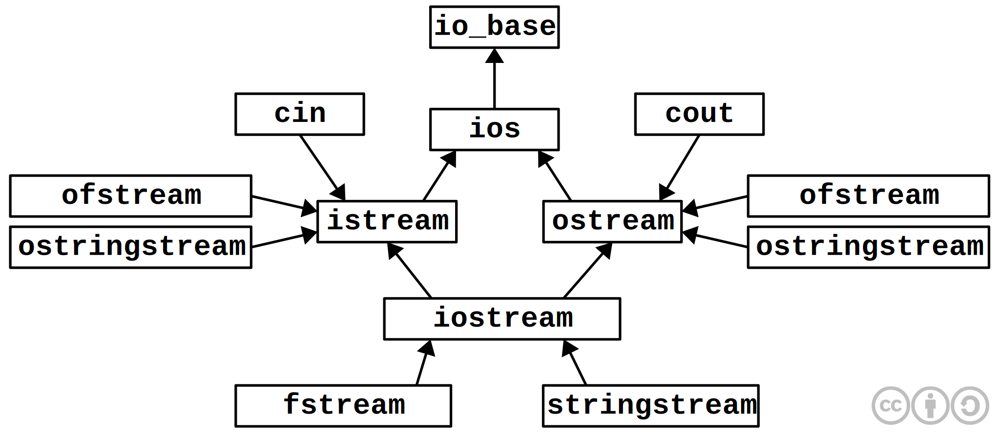

<!-- 
WARNING!!!
This file was generated automatically.
All changes made here will be erased.
-->

<script type="text/javascript">var last_page = true</script>

# Лекция 17


<a id="cpp_standard_library" title="Стандартная библиотека C++" class="toc-item"></a>
## Стандартная библиотека C++


<a id="hierarchy_stream_i_/_o_classes" title="Иерархия потоковых классов ввода/вывода" class="toc-item"></a>
### Иерархия потоковых классов ввода/вывода


Для работы с потоковыми классами ввода/вывода требуется подключение заголовочного файла `<iostream>`



**Замечание.** На примере `iostream` можно наблюдать множественное наследование (ромбовидное)


<a id="file_streams" title="Файловые потоки" class="toc-item"></a>
### Файловые потоки


```cpp
#include <fstream>
{
	ifstream ifs("a.txt");
	// по-умолчанию открывается как текстовый
	
	int i, j;
	ifs >> i >> j; // 3_4
} // здесь неявно в деструкторе будет вызван ifs.close()

{
	ofstream ofs("b.txt");
	ofs << i << "  " << j << endl;
	Frac f(1, 2);
	ofs << f;
} // так же вызовется ofs.close()
```

Благодаря наследованию мы так же можем выводить в файл дроби, аналогично с вводом. То есть нам не надо описывать отдельно ввод/вывод в файл или строку.

Рассмотрим другой пример:

```cpp
ofstream to1("c.txt", ios_base::app);
while(!ifs.eof())
	getline(ifs, s); // s - имеет тип string
```

Здесь демонстрируется открытие файла в режиме дозаписи.

В принципе этот код можно заменить на такой:

```cpp
ofstream to1("c.txt", ios_base::app);
while(ifs)
	getline(ifs, s);
```

То есть `if(!ifs)` ~ `if(ifs.eof())`, однако первый способ является более понятным.


<a id="string_streams" title="Строковые потоки" class="toc-item"></a>
### Строковые потоки


Файлы, строки и т.д. являются разными типами данных, а потоки позволяют унифицировать работу с этими данными.

Ввод в строковый поток осуществляется следующим образом 

```cpp
#include <sstream>

ostringstream os;
os << i << " " << j << frac(1, 2);
cout << os;
const char * cc = os.c_str();
```

Аналогично выполняется вывод:

```cpp
#include <sstream>

istringstream is("12 345");
is >> i >> j;
```


<a id="standard_template_library_stl" title="Стандартная библиотека шаблонов (STL)" class="toc-item"></a>
## Стандартная библиотека шаблонов (STL)


Эта библиотека появилась в C++ не сразу, но достаточно давно.

**STL** состоит из:

1. Контейнерные классы (`vector<T>`, `list<T>`, `set<T>`, `map<K,V>`, `queue<T>`, `stack<T>`... ≈10)
2. Итераторы - обобщенные указатели на элементы контейнера
3. Алгоритмы (≈60)
4. Объекты-функции (функторы) -> лямбда-выражения


<a id="total_haraktkristika_stl" title="Общая характкристика STL" class="toc-item"></a>
### Общая характкристика STL


1. Компактность
2. *Эффективность* в ущерб безопасности
3. Не используются наследование и полиморфизм для *эффективности*
4. Универсальность
5. 0 байт в откомпилированном виде т.к вся бибилиотека состоит из заголовочных файлов
6. Тяжелые сообщения об ошибках


<a id="some_algorithms" title="Некоторые алгоритмы" class="toc-item"></a>
### Некоторые алгоритмы


```cpp
template<typename It, typename It1>
void copy(It b, It e, It1 b1)
{
	while(b != e)
		*b1 = *b;
	++b;
	++b1;
}
```


