Конспект лекций по курсу ЯП
=====================

<!-- 
WARNING!!!
This file was generated automatically.
All changes made here will be erased.
-->


<a id="lecture1" title="Лекция 1" class="toc-item"></a>
# Лекция 1

## История C++

##### Основные вехи развития:

1. 1972 — создание языка С (Брайан Керниган, Деннис Ритчи)
2. 1980 — создание языка С++ (Бьярн Страуструп)
3. 2003 — принят первый стандарт языка C++
4. 2011 — принят [второй стандарт](http://www.open-std.org/jtc1/sc22/wg21/docs/papers/2012/n3337.pdf) языка C++

##### Философия С++

* Эффективность (в ущерб безопасности: например, 
	нет контроля выхода за пределы массива)
* Переносимость
* Мультипарадигмальность

## Простейшая программа

Каждая программа на C++ состоит из одной или более функций. Среди них *обязательно* должна присутствовать главная функция `main`, которую и вызывает операционная система при запуске программы. Простейший пример:

```cpp
int main() {
    return 0;
}
```

Значение, возвращаемое `main`, используется ОС для определения успешности
завершения программы. Если не ноль, то в программе произошла ошибка.

```cpp
#include <iostream>   // Заголовочный файл

int main() {
    std::cout << "Hello world!" << std::endl;
}
```
## Пространства имен

Чтобы каждый раз не писать префикс `std::`, можно включить пространство 
имён в глобальную область видимости:

```cpp
using namespace std; // Всё содержимое пространства std 
                     // становится видимым во всем файле.
                     
using std::cout;     // Либо только элемент cout становится
                     // видимым во всем файле.

int main() {
    cout << "Hello world!";
}
```

## Типы данных

| С++           | Pascal      |
| ------------- |-------------|
| int           | integer     |
| bool          | boolean     |
| double, float | real        |
| char          | char        |

Замечание: в типе `char` не поддерживается Unicode по умолчанию.

## Способы инициализации переменных

```cpp
double d = 3.14;    // старый стиль

double d {3.14};    // новый стиль
double d = {3.14};  // или так
```

## Неявное преобразование типов

В C++ при попытке присвоить целочисленной переменной значение с плавающей 
точкой, произойдёт **отбрасывание** дробной части. При инициализации в новом 
стиле будет ошибка компиляции.

```cpp
int i = 3.14;   // i == 3
int i {3.14};   // Ошибка компиляции
```

Тип `char` занимает 1 байт, поэтому диапазон его значений [-128,127], 
однако следующий код будет откомпилирован.

```cpp
char c = 128;   // c == -128
```

## Основные операции

| C++ | Pascal |  Примеры |
|:---:|:------:|:--------:|
| =   | :=     | `int a = 4;`
|  /  | div    | `7 / 3` — тип `int`;   `7 / 3.0` — `double`
|  %  | mod    |
| a++ / ++a| a = a + 1 | ...
|||
| &&  | and    |  `i > 0  &&  i != 2`
|\|\| | or     |  `i == 4  ||  i == 5`
| !   | not    |
| ==  | =      |
| !=  | <>     |
|||
| <<  | shl    | `(8 << 1  =  16)` 
| >>  | shr    |
| &   | and    | `7 & 3 == 3`
|  \| | or     |
| ^   | xor    |
| ~   | not    |

Возможна запись `a = b = c`, означающая `b = c; a = c` — множественное присваивание (справа налево).

Особое внимание стоит обратить на операцию сравнение на равенство:

```cpp
if (a = 5)  …  // (1) Неверно! Но легко пропустить
if (5 = a)  …  // (2) Неверно! И компилятор выдаст ошибку

if (a == 5) … // (3) Верно! Но если спутать с (1), то легко не заметить
if (5 == a) … // (4) Верно! И если спутать с (2), то легко увидеть: ошибка компиляции
```

## Условный оператор

```cpp
if (условие) {
    ...
} else {
    ...
}
```
Допускается сокращённая форма (без `else`).

### Тернарная условная операция

```cpp
bool flag;
if (flag) {
    cout << "true";
} else {
    cout << "false";
}
```

Более короткая запись:

```cpp
cout << (flag ? "true" : "false");
```

## Оператор выбора

```cpp
switch (i) {
    case 1:
        ...
        break;
    case 2:
    case 3:     
    ...
    default:
}
```

## Операторы цикла

### Цикл `while`

```cpp
while (x > 10) {
    x -= 1;
}
```

### Цикл `do-while`

```cpp
do {
   x--;
} while (x > 0);
```
Похож на `repeat/until` в Паскале, но используется условие продолжения 
цикла (как в `while`), а не условие окончания как в `repeat/until`.

### Цикл `for`

```cpp
for (инициализация; условие_продолжения; действие_на_каждом_шаге) {
    ...
}

for (int i = 0; i < 10; i++) {
    cout << i << " ";
}								// "0 1 2 3 4 5 6 7 8 9 "

for (;;);  // бесконечный цикл
```

## Оператор `,` (запятая)

Возвращает значение своего последнего операнда, например:

```cpp
int s = 0, i = 6;
cout <<  s = i*i, i;  // Выведет 6
```


<a id="lecture2" title="Лекция 2" class="toc-item"></a>
# Лекция 2

## Функции

```cpp
int abs(int x) {
    return x > 0 ? x : -x;  // После этого сразу выход из функции
}

// Функция, возвращающая void — процедура
void print(int i) {
    cout << "Значение = " << i;
}
```

### Стандартные функции

Математические функции объявлены в заголовочном файле
[&lt;cmath>](http://www.cplusplus.com/reference/cmath/).

```cpp
#include <cmath>
abs(x);  floor(x);  sin(x);  pow(x, y);  sqrt(x);
```

### inline-функции

Для *маленьких* функций накладные расходы на вызов функции значительно 
превышают вычисления, производимые внутри функции. Поэтому такую функцию можно 
сделать *встраиваемой*: при компиляции тело будет встроено на место её вызова.

```cpp
inline int add(int a, int b) {
    return a + b;
}

int a = 3;
int c = add(a, 5);    // int c = a + 5;
```

Слово `inline` является лишь *рекомендацией* компилятору. На секунду вам 
может показаться, что вы умнее компилятора и сами знаете, какую функцию 
необходимо делать встраиваемой; в такой момент некоторые компиляторы могут даже 
[поддаться](http://stackoverflow.com/questions/25832402/can-we-force-the-function-to-be-inline-in-c) 
вам, но помните: вы не умнее.

## Ссылки

Ссылка — другое имя объекта («псевдоним»). Ссылка всегда инициализируется
при объявлении.

```cpp
int i = 5;
int &pi = i;   // ссылка на i

pi = 3;
cout << i;     // i == 3
```

### Передача аргумента в функцию по ссылке
```cpp
void calcSquareAndPerimeter(double a, double b, double &S, double &P) {
    S = a * b;
    P = 2 * (a + b);
}

int main() {
    double SS = 0.0, PP = 0.0;
    calcSquareAndPerimeter(3.0, 4.0, SS, PP);
    cout << "Perimeter: " << PP << ", Square: " << SS << "\n";
}
```

## Структуры
```cpp
struct Student {
    string name;
    int age;
};  // точка с запятой!

int main() {
    Student s {"Иванов", 19};               // Инициализация
    cout << s.name << ' ' << s.age << endl;
    
    Student s2 = s;                         // Независимая копия s
    s2.name = "Петров";
    cout << s.name;                         // "Иванов"
}
```

### Передача структуры в функцию

Желательно передавать структуру в функцию по ссылке, иначе будет передана её полная копия; `const` запрещает изменение полей структуры.

```cpp
void print(const Student &s) {
    cout << s.name << ' ' << s.age << endl;
}
```


<a id="lecture3" title="Лекция 3" class="toc-item"></a>
# Лекция 3

## Многофайловая компоновка

Говорят, что переменная описана (определена), если она объявлена и под неё 
выделена память. Рассмотрим следующий пример, пусть в проекте есть два файла:

```cpp
/* a.cpp */
extern int n;    // "Где-то дальше определено"
void f(int);     // Предварительное объявление

void main() {
    n = 5; f(n);
}


/* b.cpp */
#include <iostream>
int i;           // Описание переменной

// Определение функции
void f(int i) {
    std::cout << i;
}
```
В C++ имеет место *независимая* компиляция: все файлы проекта компилируются 
независимо один от другого. Компиляция состоит из этапа собственно компиляции 
и этапа **линковки**.

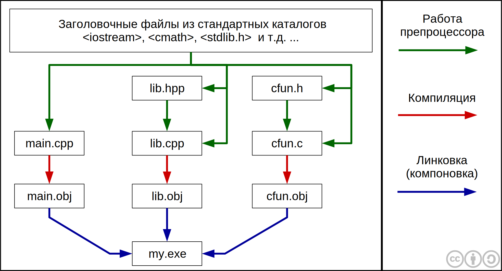

## Заголовочные файлы

Содержат заголовки всех функций и объявления переменных, обычно имеют 
расширение `*.h` (header). Теперь можно вынести объявления функций из всех 
файлов в один (заголовочный):

```cpp
/* myheader.h */
extern int n;
void f(int);

/* myheader.cpp */
#include <iostream>
int n;

void f(int i) {
    std::cout << i;
}


/* a.cpp */
#include "myheader.h"

void main() {
    n = 5; f(n);
}

/* b.cpp */
#include "myheader.h"

void makeZero() {
    n = 0;
}
```

Имена пользовательских заголовочных файлов в директиве `include` 
заключаются в двойные кавычки, а имена стандартных заголовочных файлов —
в угловые скобки. Стандартные заголовочные файлы расположены в `/INCLUDE`.
Поиск пользовательских файлов производится в текущем каталоге.

*Замечание*: inline-функции не сохраняются в исходном коде, так как больше не 
используются (а сразу встраиваются на место вызова). Чтобы воспользоваться 
такими функциями в другой единице компиляции, их нужно поместить в 
заголовочный файл.

### Содержимое заголовочных файлов

Что может содержать заголовочный файл:

|                                 | Пример                                    |
|---------------------------------|-------------------------------------------|
| Определения типов               | `struct point { int x, y; };`             |
| Шаблоны типов                   | `template<class T> class V { /* ... */ }` |
| Описания функций                | `extern int strlen(const char*);`         |
| Определения встраиваемых функций| `inline char get() { return *p++; }`      |
| Описания данных                 | `extern int a;`                           |
| Определения констант            | `const float pi = 3.141593;`              |
| Перечисления                    | `enum bool { false, true };`              |
| Описания имен                   | `class Matrix;`                           |
| Команды включения файлов        | `#include <signal.h>`                     |
| Макроопределения                | `#define Case break;case`                 |
| Комментарии                     | `/* проверка на конец файла */`           |

В заголовочном файле никогда не должно быть:

|                                 | Пример                                    |
|---------------------------------|-------------------------------------------|
| Определений обычных функций     | `char get() { return *p++; }`             |
| Определений данных              | `int a;`                                  |
| Определений составных констант  | `const tb[i] = { /* ... */ };`            |


## Глобальные описания в C++ и необходимость пространств имен

При простом определении глобальных сущностей они объединяются в глобальном пространстве имен. Для создания локального пространства имен используется ключевое слово **`namespace`**.

```cpp
namespace MyNamespace{
    ... // содержимое пространства имён: типы, функции, что-угодно…
}
```

## Пространства имен и заголовочные файлы

Прототипы функций и глобальные переменные в заголовочных файлах, особенно в крупных проектах, необходимо заключать в пространства имен.

```cpp
/* header.h */
namespace MyNamespace{
    extern int n;
    void f();
}
```

## Основные этапы сборки проекта

1. Препроцессирование.
2. Компиляция каждого `*.cpp`-файла в объектный код (файлы `*.obj` или `*.o`).
3. Линковка — сборка всех объектных файлов в один исполняемый
	(`*.exe` или `ELF`).

#### Ошибки во время линковки

* Одинаковые объявления в одном пространстве имен.
* Ошибки при использовании `#include "*.cpp"` (грубая ошибка).
* Отсутствие описания функции.
* Отсутствие `main()` во всех файлах проектах.
* Несколько объявлений `main()`.

#### Особенности линковки

* Константы имеют внутреннюю линковку.
* `inline`-функции «погибают» при компиляции.


<a id="lecture4" title="Лекция 4" class="toc-item"></a>
# Лекция 4

## Препроцессор

### Основные директивы препроцессора

* `#include` — вставляет текст из указанного файла,
* `#define` — задает макроопределение (макрос) с параметрами или без
			  (во втором случае это просто символическая константа),
* `#undef` — отменяет предыдущее определение,
* `#ifdef` — осуществляет условную компиляцию при определённости макроса,
* `#ifndef` — осуществляет условную компиляцию при неопределённости макроса,
* `#else` — ветка условной компиляции при ложности выражения.

### Условная компиляция

```cpp
#define FLAG1

#ifdef FLAG1
  // Код, помещённый здесь, откомпилируется только,
  // если определена макроподстановка FLAG1
#else
  // Данный код откомпилируется, если макроподстановка FLAG1 не определена
#endif /* FLAG1 */ 
```

### Стражи включения (include guards)

**Include guards** — шаблонная конструкция (клише), вставляемая в 
заголовочный файл.

```cpp
#ifndef H_FILE_NAME_HPP
#define H_FILE_NAME_HPP

// Содержимое заголовочного файла

#enfif /* H_FILE_NAME_HPP */
```
Такая кострукция защищает проект от повторного включения прототипов функции и зацикливания на этапе препроцессирования, что, в свою очередь, приводит к сокращению времени компиляции, а в случае зацикливания к корректной сборке проекта. 

##Precompiled headers

В режиме включенных предкомпилированных заголовков при компиляции 
заголовочных файлов все они попадают в откомпилированном виде в файл 
`*.pch` (для Visual Studio), тогда при необходимости повторного 
использования они не компилируются заново, а берутся из `*.pch`. Это 
приводит к уменьшению времени компиляции в **больших проектах**.

## Перечисления

### Перечисления в C++98

Перечисления, согласно стандарту C++98, объявляются следующим образом:
```cpp
enum DayOfWeek {MON, TUE, WED, THU, FRI, SAT, SUN};
```

Каждый элемент перечисления это целое число: `MON = 0`, `TUE = 1`, …
При этом существует возможность явно задавать значения элементов `enum`.
Например:

```cpp
enum DayOfWeek {MON, TUE = 3, WED, THU, FRI, SAT, SUN};
```

Тогда `MON = 0`, `TUE = 3`, `WED = 4`, …

Благодаря тому, что все имена перечисления являются целыми числами 
возможно следующее присваивание:

```cpp
int day = MON;     // Ok, day == 0;

DayOfWeek dow = 5  // Ошибка компиляции
DayOfWeek wod = static_cast<DayOfWeek>(5);
```

### Перечисления в C++11

При объявлении `enum` все имена перечисления экспортируются во внешнюю обасть 
видимости, это приводит к проблеме коллизии имен в крупных проектах. Для 
решения данной проблемы в C++11 был введен `enum class` — строго 
типизированные перечисления с ограниченной областью видимости. Объявление 
`enum class` происходит следующим образом:

```cpp
enum class DayOfWeek {MON, TUE, WED, THU, FRI, SAT = 6, SUN};
```

При этом особенности работы с ним следующие:

```cpp
// Ошибка при преобразовании DayOfWeek к int
int day = DayOfWeek::WED;

// Ошибка: WED нет в облати видимости
int wday = WED;

// Присваение переменной значения из множества имен перечисления DayOfWeek
DayOfWeek dow = DayOfWeek::FRI;

// При необходимости присваивания переменной типа DayOfWeek целого числа
// можно воспользоваться оператором static_cast<type>(object);
DayOfWeek sat = static_cast<DayOfWeek>(6);
```

### Использование перечислений

Часто имена перечислений используются в операторе `switch`.

```cpp
switch (dayOfWeek) {
    case DayOfWeek::MON: cout << "Monday\n"; break;
    case DayOfWeek::TUE: cout << "Tuesday\n"; break;
    case DayOfWeek::WED: cout << "Wedesday\n"; break;
    case DayOfWeek::THU: cout << "Thusday\n"; break;
    case DayOfWeek::FRI: cout << "Friday\n"; break;
    case DayOfWeek::SAT: cout << "Satuday\n"; break;
    case DayOfWeek::SUN: cout << "Sunday\n"; break;
}
```

## Массивы

#### Особенности массивов в С/C++:

* Элементы массивов индексируются с нуля.
* Нет контроля выхода за пределы массива.
* Высокая скорость работы с массивом (как следствие предыдущего).
* Массив не хранит свой размер.

#### Работа с массивами C/C++:

```cpp
// Создание массива из 5 элементов типа int
int b[5]; 

// Создание и инициализация массива из 4 элементов 
int a[] = {2, 3, 5, 7};

// Запись в последний элемент масива
a[3] = 1;

// Так нельзя копировать, только в цикле
b = a;  
```

Так как массивы в C/C++ не помнят своего размера, то его необходимо определять вручную след образом:

```cpp
int size = sizeof(arr2) / sizeof(int);
	// sizeof(arr2) возвращает размер массива в байтах
	// sizeof(int) возвращает размер элемента массива
```

#### Цикл по массиву (foreach)

```cpp
int a[] = {3, 7, 9, 5, 7, 2, 7};

for (int x : a)     // Доступ к x только на чтение
    cout << x;  

for (int &x : a)    // x передается по ссылке, поэтому
    x += 1;         // доступ есть на чтение и запись
```

#### Передача массива в функцию

В C/C++ массив **всегда** передается по ссылке, поэтому использование
оператора `sizeof()`, для определения его размера, бесполезно. Потому при 
передаче массива в функцию следует явно передавать и его размер.

```cpp
const int n = 5;
int a[n] = {1, 3, 5, 6, 1};  // создали массив фиксированной длины 5

// …

void f(int a[], int len) {   // создали функцию для работы с массивами
  // …                       // любой заданной длины len
}

// …

f(a, n);                     // вызвали функцию для нашего массива длины 5
```


<a id="lecture5" title="Лекция 5" class="toc-item"></a>
# Лекция 5

## Строки в стиле C

В языке С строки определяются как одномерный массив типа `char`.

```cpp
char str[] = "Hello world!!!";
```

Это строка из 14 символов, однако размер массива будет равен 15, так как
строки в C заканчиваются символом `\0` — нуль терминатор (нулевой байт:
байт, все биты которого равны 0). Иногда такие строки называют 
нуль-терминированными.

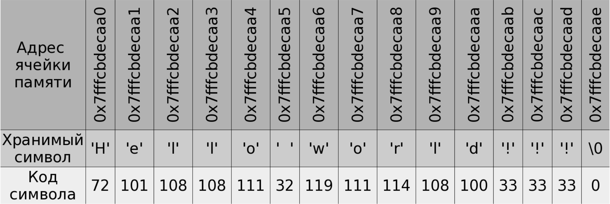

Недостаток такого подхода состоит в том, что для того чтобы узнать 
длину строки необходимо просканировать всю строку до конца, 
в поисках `\0` — это может занять много времени. 

При попытке стандартным образом ввести с консоли значение "Hello world!" в 
`str`, будет введено только "Hello" (до первого пробела). Чтобы этого не 
происходило можно использовать следующую запись:

```cpp
std::cin.getline(str, 14);  // 14 — количество вводимых символов
```

## Строки в стиле C++

В 1980 году появился класс `string`:

```cpp
string s1 = "Hello ";
string s2 = "world !!!";

s1.size();  // s1 - экземпляр класса, он помнит свою длину
s1[0];		// Индексация символов с нуля
s1 = s2;	// Строки можно присваивать друг другу
s1 += s2;	// Строки можно прибавлять друг другу 
s1 == s2;
s1 < s2;	// Строки можно сравнивать
```

Несмотря на то, что скорость работы C-строк немного выше чем у класса
`string`, на прикладном уровне лучше использовать `string`. Однако 
системным программистам чаще приходится пользоваться `char*`.

### Ввод-вывод

```cpp
cout << s
cin >> s;
```

Если мы вводим "Hello world" в `s` будет храниться только "Hello", 
поэтому надо использовать `getline(cin, s);`.

### Как передавать в функции C- и C++-строки

#### С-строки
```cpp
void p(char s[])        // s передается по ссылке
void p(const char s[])  // const запрещает изменение s
```

#### С++-строки

```cpp
void p1(string &s)         // s можно менять
void p1(const string &s)   // s нельзя менять
```

## Двумерные массивы

Двумерные массивы определяются как массив массивов. Вот как будет 
выглядеть двумерный массив `int a[3][4]`.

|       |       |       |       |       |
|-------|-------|-------|-------|-------|
|…      |a[ ][0]|a[ ][1]|a[ ][2]|a[ ][3]|
|a[0][ ]|a[0][0]|a[0][1]|a[0][2]|a[0][3]|
|a[1][ ]|a[1][0]|a[1][1]|a[1][2]|a[1][3]|
|a[2][ ]|a[2][0]|a[2][1]|a[2][2]|a[2][3]|


### Передача в функции двумерных массивов

```cpp
void print(int a[3][4], int m, int n) {
    for (int i = 0; i < n; i++)       
        ...
}
```

При передаче массива в функцию сохранится размер массива `a[][4]`: 
размер внешнего массива потеряется, а размер внутренних массивов сохранится.


## Определение типов в C++

Синонимы (псевдонимы) типов определяются с помощью `typedef`.

```cpp
typedef unsigned char byte;

typedef int Arr[3];     // Arr имя типа
typedef int Matr[3][4]; // Matr имя типа

// Теперь можно использоваать
void print(Matr a, int m, int n);
```

По сути объявление переменной `Matr a` будет заменено на `int a[3][4]`.

## Указатели и адреса

C++ унаследовал от C возможность работы на низком уровне.

Пусть мы имеем ячейку памяти `int i = 5`. Объявление `int *p;` вводит 
указатель, то есть переменную, которая может хранить адрес ячейки памяти
с любым `int`, например, `i`.

```cpp
int i = 5;
int *p;
p = &i     // В указателе p хранится адрес ячейки памяти i
```

Можно использовать нулевой указатель, чтобы показать, что переменная-указатель 
пока не хранит никакого адреса. Для этого есть несколько способов.

```cpp
p = NULL;    // Так часто делали в C. Макрос NULL определён в <cstdlib>.
p = 0;       // Так советует Страуструп для C++98.
p = nullptr; // C++11
```

Если `*` пишется перед именем переменной, то эта переменная — указатель, 
а `*` — операция разыменования. Если `*` после типа переменной, то это 
объявление указателя (как во всех примерах выше).

```cpp
*p = 6 // Операция разыменования
```

### Указатели и ссылки

```cpp
//Указатели
int *p = &i;
*p = 6; 

// Ссылки
int &r = i;   // i и r — одна ячейка памяти
r = 6;
```

Если `&` пишется после названия типа, то это [ссылка](lecture_02.md#4).
В противном случае, если он пишется перед именем переменной, 
то это адрес этой переменной. 
Ссылку можно трактовать, как указатель, который постоянно находится в 
разыменованном состоянии.

### Передача параметров в функции

По ссылке:

```cpp
void q(int &r) {
    r++;
}

int i = 5;
q(i);      // i == 6
```

По указателю:

```cpp
void q(int *p) {
    (*p)++;   // Скобочки важны!!!
} 

int i = 5;
q(&i);     // i == 6
```

Производительность в обоих случаях одинаковая.

### Указатель `void*`

```cpp
void *p;    // указатель на область памяти

int i = 5;
p = &i;

double d = 3.14;
p = &d;
```

т.е. `p` может хранить адрес любого объекта.

```cpp
void *p = &i

// Ошибка компиляции: нельзя разыменовать p
*p = 6

// Явное приведение к типу int* в стиле C
(int*)p = 6;    

// Использование представляет опасность если i не является int.
// Стиль C++ более явно заявляет об этой опасности:
*static_cast<int*>(p) = 6;       // но работает точно так же, как и выше

p = &d;
*static_cast<double*>(p) = 2.8;
```

Невозможно выполнить:

```cpp
int *pa;
double *pb;
pa = pb;
pb = pa;
```

Но можно с помощью явного приведения типов (в стиле C или в стиле C++,
но не `static_cast`, а `reinterpret_cast`).

### Указатели на структуры

```cpp
struct Person {
     string name;
    int age;
};

Person p {"Иванов", 19};
Person *pp = &p;
(*pp).age = 20;
pp -> age = 20;   // Операция доступа к полю в памяти
```

### Указатели и константность

```cpp
int i = 5;
int *p = &i;
const int *cp = &i; // Указатель на константу
cout << *cp;
*cp++;              // Ошибка компиляции
```

Это используется при передаче в функции

```cpp
void q(const int *p) {
  (*p)++;      // Ошибка компиляции
  cout << *p;
}
```

### Константные указатели
```cpp
int = 5;
const int n = 10;      // Обычная константа
int* const pc = &i;    // Константный указатель
pc = &j;               // Ошибка компиляции
(*pc)++;               // А здесь ошибки не будет
```

Другой пример. Нельзя обычному указателю присваивать адрес константы:

```cpp
const int n = 10;
int* pn = &n;    // Ошибка компиляции

const int *pn = &n;
*pn = 11;        // Ошибка компиляции
cout << *pn;
```

Однако возможно заставить компилятор снять константность:

```cpp
*const_cast<int*>(pn) = 11;
```

#### Константный указатель на константу

```cpp
const int* const pn = &n;
```


<a id="lecture6" title="Лекция 6" class="toc-item"></a>
# Лекция 6

## Ссылки на константы

```cpp
	int i = 5;
	int& ci = i;
	const int& cci = i; // Здесь все будет нормально
	const int n = 10;
	int& cn = n; // Такое компилятор запретит
	int& cn = const_cast<int>(n);
	const int& ccn = n; 
```

## Указатели и массивы

В C++ указатели и массивы тесно связаны

```cpp
int a[10];

int* p = &a[0]; // адрес первого элемента
*p = 5;
```

|a[0]|a[1]|a[2]|a[3]|a[4]|a[5]|a[6]|a[7]|a[8]|a[9]|
|----|----|----|----|----|----|----|----|----|----|
|5   |    |    |    |    |    |    |    |    |    |
|*p  |    |    |    |    |    |    |    |    |    |


### Операции при работе с указателями

В Pascal таких операций нет т.к он является более высокоуровневым языком.

Выполним следующую операцию `p++;`. Теперь указатель `p` указывает на следующий(второй) элемент массива.

|a[0]|a[1]|a[2]|a[3]|a[4]|a[5]|a[6]|a[7]|a[8]|a[9]|
|----|----|----|----|----|----|----|----|----|----|
|5   |    |    |    |    |    |    |    |    |    |
|    | *p |    |    |    |    |    |    |    |    |

Операция `p++` увеличивает адрес в зависимости от типа указателя т.е. 
`p++ ~ p += sizeof(int)`

```cpp
p += 1;		// Переход на следующий элемент массива
p += n;		// Увеличение на n элементов массива
p+1		// Адрес следующего элемента	 
p+n = p1;	// Записать в `p1` адрес n-го элемента
p1 - p = n;	// Количество между указателями
```

А вот складывать указатели нельзя!!!

```cpp
*(p+0) и a[0] - являются ссылками на первый элемент массива
*(p+1) и a[1] - являются ссылками на второй элемент массива
*(p+2) и a[2] - являются ссылками на третий элемент массива
```

т.е `a[n] == *(p+n)` - связь массивов и указателей

Имя массива `a` может быть неявно преобразовано к указателю на свой первый
элемент. Т.е на самом деле `а` это указатель на первый элемент массива. 
Значит мы можем написать проще:

```cpp
int* p = a;
```

`a` является константным указателем на свой первый элемент т.е он как-бы 
описан таким образом `int* const a;`

Отсюда становится понятно, почему нельзя писать `a = a1`. Т.к имя массива константный указатель , то нельзя присваивать один массив другому.

Вообще говоря, более строгая связь массивов и указателей выглядит следующим
образом: `a[n] == *(a+n)`

Отсюда следует вывод(крамольная истина):
`В языке C массивов нет - есть только указатели!!!`

**Следствие 1.** Понятно, почему нет контроля выхода за границы массива.

**Следствие 2.** Понятно почему массивы индексируются с нуля. Это самое эффективное по этой формуле.

**Следствие 3.** `a[n] == *(a+n) == *(n+a) == n[a]`


### Идиома *p++

**Идиома** - устойчивое выражение, которое воспринимается как единое целое.

Теперь допустим, нам необходимо сделать следующее:

```cpp
int a[10];
int* p = a;

*p = 3;
p++;
```

Для краткости это хочется заменить на `*(p++) = 3;` А что, если записать `*p++`? Это можно воспринимать как `*(p++)` или как `*(p)++`. В C/C++ унарные операции ассоциируются справа налево, поэтому в данном случае `++` относится к указателю, 
следовательно `*p++ ~ *(p++)`.

**Пример 1.** Заполнить массив `a` нулями

```cpp
int a[10];
//int* p = a; // Однако это можно перенести в раздел инициализации for(;;)

for(int* p = a; p != a+10; *p++ = 0;);
```


### Передача массива в функцию с помощью указателя

```cpp
void InitZero(int* a, int n)
{
  for(int* p = a; p != a+n;) *p++ = 0;
}

// int* a ~ int a[] 
```

**Пример 2.** Даны 3 массива `int a[10], b[10], c[10]`. Необходимо заполнить
массив `c[10]` суммой элементов массивов `a[10]` и `b[10]`.

```cpp
int *pa = a, *pb = b, *pc = c;

//for(; pa != a + 10;)
while(pa != a + 10)
  *pc++ = *pa++ + *pb++;
```


## С-строки и указатели


**Пример 1.**


```cpp
char s[10] = "Hello";
```

|s[0]|s[1]|s[2]|s[3]|s[4]|s[5]|s[6]|s[7]|s[8]|s[9]|
|----|----|----|----|----|----|----|----|----|----|
|H   |e   |l   |l   |o   |\0  |\0  |\0  |\0  |\0  |

```cpp
char* pc = s;
//while(*pc != '\0') // Но можно короче 
while(*pc)
  cout << *pc++ <<  ' ';
```

**Пример 2.** Копирование строк

```cpp
char s[10] = "Hello";
char s1[10];

s1 = s; // Нельзя т.к. s1 объявлен как char* const s1

char* mysrtcpy(char* p, const char* q)
{
  while(*q)
    *p++ = *q++;
  *p = 0;
  return p-1;
  
  // Или можно сделать короче, но менее понятно

  while(*p++ = *q++);
  return p-1;
}
```


<a id="lecture7" title="Лекция 7" class="toc-item"></a>
# Лекция 7

## Стандартные функции для работы с C-строками

```cpp
#include <cstring>

// Возвращает длину строки p
size_t strlen(const char* p);

// Копирует строку q в строку p 
char* strcpy(char* destination, const char* source);
// Возвращает указатель на последний символ скопированной строки

// Сравнение строк в лексикографическом порядке
int strcmp(const char* s1, const char* s2);
// < 0, s1 < s2
// = 0, s1 == s2
// > 0, s1 > s2

// Добавляет source в конец destination
char* strcat (char* destination, const char* source);
// Считается, что в строке s1 достаточно памяти

// Ищет в строке s символ с
char* strchr(const char* s, char c);

// Ищет в строке s подстроку s1
char* strstr(const char* s, const char* s1);
```

### Контроль памяти при работе с этими функциями

```cpp
char* s1 = "Hello";
char s1[];       // Указатель объявляется как неизменяемый
char* s2;

strcpy(s2, s1);  // Не работает, потому что память под s2 не выделена.

char s2[4];
strcpy(s2, s1);
```

Контроль памяти лежит на программисте. В случае возникновения ошибки она, 
по-началу, может себя никак не проявить.

Обычно такие опасные функции стараются не использовать. Вместо них применяют
аналогичные функции, контролирующие размер записываемых данных.

```cpp
char* s1 = "Hello";
char s2[4];
strncpy(s2, s1, 4);  // Защищает от переполнения
```


## Указатели и динамическая память

В C/С++ динамическая память управляется с помощью указателей.

**Замечание.** В С++ сборщика мусора нет! Ответственность за 
выделение и освобождение памяти лежит на программисте.

Если необходимо в динамической памяти выделить место для `int`, используется
оператор `new`.

```cpp
int* pi = new int;

*pi = 5;
(*pi)++; // *pi == 6
```

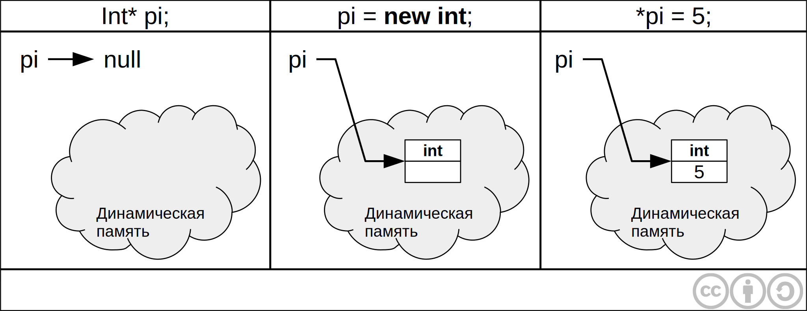

Освобождение памяти производится с помощью оператора `delete`.

```cpp
delete pi;
pi = nullptr;  // Хороший стиль
```

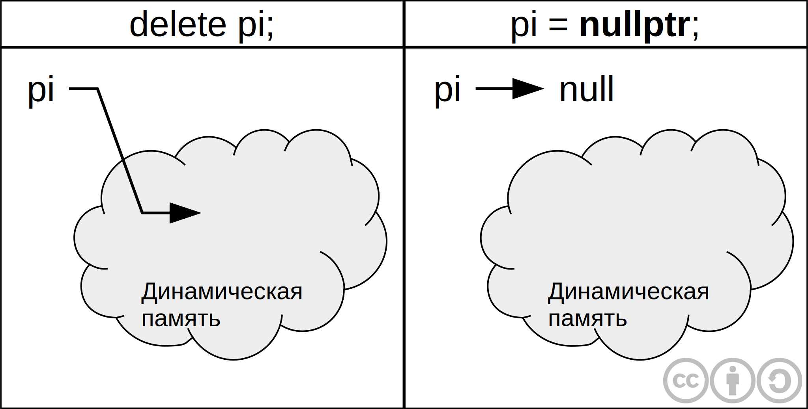

Присваивание, указателю на высвобожденную память, значения `nullprt` защищает
от ошибки при повторном (ошибочном вызове) `delete`.


### Ошибки при работе с динамической памятью

##### 1. Попытка разыменования нулевого указателя

```cpp
int *pi;
*pi = 5
```

##### 2. Утечка памяти

```cpp
int *pi = new int;
pi = new int;

// Особенно сильно это чувствуется при использовании в циклах
for(;;)
  pi = new int;
```

Если в процессе работы функции выделяется динамическая память, то ее следует
освобождать в теле той же функции. Если же указатель на динамически выделенную
память передается в качестве результата работы функции, то необходимо 
озаботиться об освобождении этой памяти вне тела этой функции. 
Такой принцип работы не всегда очевиден - тем и опасен.

```cpp
void f()
{
  int* pi = new int;
}
```

##### 3. Обращение к освобожденной памяти

```cpp
int *pi = new int;
*pi = 5
delete pi;
*pi = 6;
```

## Массивы в динамической памяти(динамические массивы)

```cpp
int* pi new int[10]; // Выделение памяти для 10 элементов

pi[0] = 5;
pi[1] = 3;
...
```

Для возврата этой памяти используется оператор `delete[]`:

```cpp
delete[] pi;
```

**Примечание.** Обычно менеджер динамической памяти размещает в отрицательных
адресах массива размер выделенной памяти, однако использовать эту информацию,
скорее всего, не удастся.


### Как передавать динамические массивы в функции

```cpp
void print(const int* pi, int size)
{
  for(int i = 0; i < n, i++)
    cout << pi[i] << ' ';
}

...

int* pi = new int[10];
print(pi, 10);
```

## Двумерные динамические массивы 


### Выделение памяти для статических массивов

```cpp
int a [3][4]; // размеры это константы, поскольку память должна выделяться
              // на этапе компиляции

void f(int a[][4], int m, int n)
{
  ...
}
```

Вообще говоря. так писать плохо. В таких случаях лучше использовать двумерные динамические массивы.

### Выделение памяти для динамических массивов

```cpp
int** a; // a - указатель на начало массива из int*

int m, n;
cin >> m >> n; // Здесь размеры определяются на этапе выполнения программы
a = new int*[m];
```

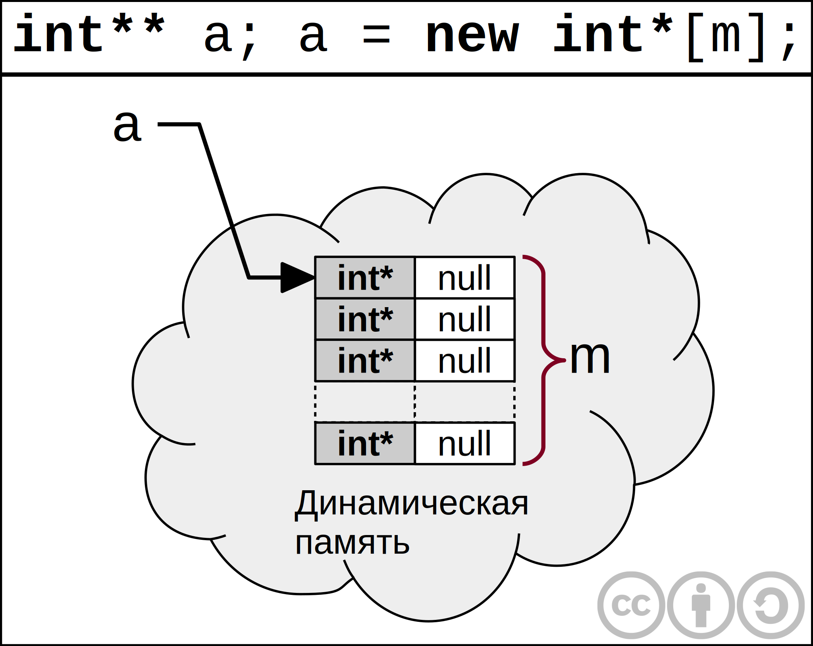

Каждый элемент имеет тип `int*`  и значение `NULL`.

```cpp
for(int i = 0; i < m; i++)
  a[i] = new int[n];

// Теперь можно обращаться
a[1][2] ~ *(*(a+1)+2)
```

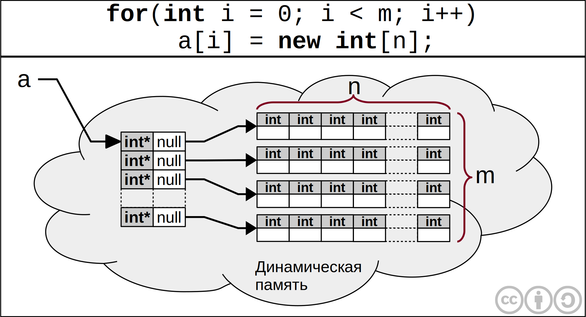

### Передача двумерного динамического массива в функции

```cpp
void print(const int** a, int m, int n)
{
  for(int i = 0; i < m; i++)
  {
    for(int j = 0; i < n; j++)
      cout << a[i][j] << ' ';
    cout << endl;
  }
}
```

Двумерный **статический** массив в эту функцию передать нельзя.


**Замечание.** Динамические массивы позволяют задавать свой размер во время выполнения программы.


### Возврат памяти

```cpp
for(int i = 0; i < m; i++)
  delete[] a[i];
delete[] a;
```

## Динамические структуры данных

#### Линейный односвязный список

```cpp
struct node
{
  int dat;
  node* next;
  node(int data, node* next)
  {
    // this указатель на себя
    this->data=data;
    this->node=next;
  }
};
```
В С++ объект вызова конструктора не содержится в динамической памяти.

```cpp
node n1(4, nullptr);
```

Память под `n1` выделяется на стеке самой программы, а конструктор лишь инициализирует поля.

```cpp
node n2(3, &n1);
node n3(5, &n2);

node* p = &n3;
```

## Шаблоны структур

Шаблоны впервые появились в C++, затем они перекочевали в  других языках программирования

```cpp
template<typename T>
struct node
{
  T dat;
  node<T>* next;
  node(T data, node<T>* next)
  {
    // this указатель на себя
    this->data=data;
    this->node=next;
  }
};
```

Теперь предыдущий пример будет выглядеть следующим образом:

```cpp
node<int> n1(4, nullptr);
node<int> n2(3, &n1);
node<int> n3(5, &n2);

node<int>* p = &n3;
```


<a id="lecture8" title="Лекция 8" class="toc-item"></a>
# Лекция 8

## Линейный односвязный список в динамической памяти

Воспользуемся для создания линейного списка [шаблон](07.html#templates_structures) структурой `node` из 7 лекции:

```cpp
template<typename T>
struct node
{
    T data;
    node<T>* next;

    node(T data, node<T>* next)
    {
        // this указатель на себя
        this->data = data;
        this->next = next;
    }
};
```

При объявлении нового экземпляра структуры `node`, как это описано 
в предыдущей лекции, этот объект создается в статической памяти.
То есть объект `n1` будет храниться на стеке:

```cpp
node<int> n1(5, nullptr);
```

В реальных программах, ввиду сильной ограниченности размера стека, 
объекты размещают в динамической памяти.

#### Как создать node<T> в динамической памяти

```cpp
node<int>* pn = new node<int>(5, nullptr);
```

В C++ динамическую память выделяет не конструктор, а оператор `new`. 
Конструктор только создает объект в выделенной памяти. 

В отличии от **.NET** в C++ нет сборщика мусора, и ответственным
за удаление объекта из динамической памяти, является программист.

В C++ _размерная модель_ объектов, а ссылочную можно 
моделировать с помощью указателей.

## Добавление элемента в начало односвязного списка

```cpp
node<int>* pn = nullptr;
pn = new node<int>(5, pn);
```

Операцию добавления первого элемента в односвязный список мы
оформим в виде отдельной функции. Создадим шаблон такой функции.

```cpp
tempate <typename T>
void add_first(node<T>* &pn, T x)
{
    pn = new node<T>(x, pn);
}
```

Запись `node<T>* &pn` означает, что `pn` это ссылка на указатель 
типа `node<T>`, и изменения происходящие с ней внутри фунцкии 
повлияют и на изменение фактического параметра.

```cpp
node<int>* pn = nullptr;

add_first(pn, 5);
add_first(pn, 3);
...
```

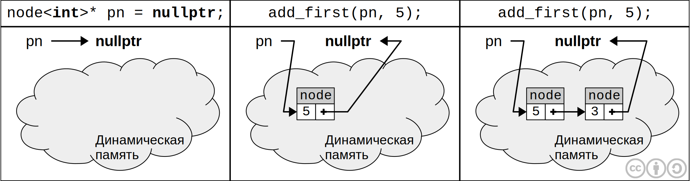

Надо обратить внимание на то, что в отличии от шаблона структуры, 
в шаблоне функции указывать тип не надо, он автоматически 
выводится по типам фактических параметров.


### Где хранить шаблоны функций, структур и классов.

В результате компиляции шаблона генерируется 0 байт, поскольку 
конкретный тип не указан. Если описать шаблон функции в одном 
`*.cpp` файле, то при многофайловой компоновке программы эта функция 
не будет доступна в другом файле.

**Решение.** Все шаблоны функций, классов и структур должны быть помещены в 
заголовочные файлы.

Для шаблонов функций конкретный код генерируется при вызове функции, 
когда становится известен конкретный тип `Т`. Подстановка конкретного 
типа в шаблон называется **инстанцированием** шаблона.
Количество инстанций зависит от количества используемых типов.

В C++ шаблоны компилируются в два этапа:

1. Компиляция собствено шаблона
2. Компиляция шаблона инстанцированного конкретным типом.

И на каждом этапе могут возникнуть ошибки. 


### Отличие шаблонов C++ от обобщений .NET

* В С++ компиляция шаблонов проходит в два этапа, а в **.NET** обобщения компилируются 1 раз.

* В С++ в результате компиляции шаблона получается исполняемый код инстанцированных 
функций, структур и классов. В **.NET** в результате компиляции обобщения создается 
исполняемый код самого обобщения т.е в **.NET** можно создать dll с обобщенным классом.

```cpp
template<typename T>
T inc(T t)
{
    return t + 1;
}
```

* В C++ разрешаются все действия с типом T, а в .NET и Java запрещаются все действия 
которые явно не разрешены (разрешения делаются в where). 

```cpp
Student s(...);
inc(s);  // В C++ произойдет ошибка на этапе компиляции
         // А в динамических языках это ошибка времени исполнения
```

## Цикл по односвязному списку

```cpp
template <typename T>
void print(node<T>* p)
{
    while(p)
    {
        cout << p -> data << ' ';
        p = p -> next;
    }
}
```

## Указатели на функции

В PascalABC.NET работа с указателями на функции осуществляется следующим образом:

```pas
type BitOp = function (a, b: real): real;

var op: BinOp;
write(op(3, 5));
op := mult;
write(op(3, 5));
```

Аналогичный код на C++ выглядит так:

```cpp
// Указатель на функцию с таким прототипом
typedef double (*BinOp) (double, double);

BinOp bop = &add;
(*bop)(3, 5);


// Или как и описание переменной
double (*op)(double, double)

op = mult;
op(3, 5);    // Так тоже можно вызывать template <typename T>
```

### Действие передаваемое параметром (callback)

```cpp
template <typename T>
// action — переменная типа "указатель на функцию"
void for_each(node<T>* p, void (*action)(T&))
{
    while(p)
    {
        action(p -> data);
        p = p -> next;
    }
}

void print(int &x)
{
    cout << x << ' ';
}

void inc(int &x)
{
    x++;
}

for_each(pn, print);
for_each(pn, inc);
for_each(pn, print);
```

В языке C/C++ структурная эквивалентность типов, а не именная.
 


<a id="lecture9" title="Лекция 9" class="toc-item"></a>
# Лекция 9

## Освобождение памяти занимаемой списком

После использования структуры необходимо освободить выделенную для неё память.<br>
Если этого не сделать, то можно наткнуться на так называемую [_утечку памяти_][memory leak].

```cpp
template <typename T>
void delete_list(node<T>* p)
{
    while(p)
    {
        auto p1 = p;
        p = p -> next;
        delete p1;
    }
}
```

После завершения программы, вся выделенная динамическая память будет 
принудительно возвращена системе. Однако не стоит опираться на этот факт.

В сложных задачах, ручное освобождение памяти может представлять большую проблему. Например, в графах, где легко может утеряться указатель на другие узлы.
[memory leak]: http://en.wikipedia.org/wiki/Memory_leak

## Векторы и строки (С++)

К моменту создания C++, внезапно оказалось, что _C_-строки, представимые в виде массива символов, ровно как и нерасширяемые массивы, морально устарели. Поэтому Бьярн Страуструп ввёл супер удобные классы [`string`][doc string] и [`vector<T>`][doc vector], которые несколько повышают уровень абстракции и работают столь же эффективно.

[doc string]: http://www.cplusplus.com/reference/string/string/
[doc vector]: http://www.cplusplus.com/reference/vector/vector/

### Работа со строками

Операции  | Описание
:-------: | :--------:
[`s[i]`][doc scrotchets] | i-ый символ
[`s.size()`][doc ssize]  | Размер строки
[`s.c_str()`][doc sc_str]| Константный указатель на _c_-строку
[`string s1 = s`][doc sequality]| Новая копия строки
|
[`s.erase(1, 3)`][doc serase]   | Удаление 3 символов
[`s.substr(1, 3)`][doc ssubstr] | Подстрока из 3 символов
[`s.insert(1, s1)`][doc sinsert]| Вставка s1 перед 1 символом
[`s.find_first_of(s1)`][doc sfo]| Поиск любого символа из s1
[`s.find(s1)`][doc sfind]       | Поиск подстроки в строке
|
[`string::npos`][doc snpos]     | -1, ~ нет совпадений

`string::npos` — это специальная константа, которая была введена в язык для обозначения несуществующего индекса в массиве. Значение этой константы, строго говоря, зависит от реализации стандартной библиотеки, однако, как правило, ее значение равно `-1`. 

[doc scrotchets]: http://www.cplusplus.com/reference/string/string/operator[]/
[doc ssize]: http://www.cplusplus.com/reference/string/string/size/
[doc sc_str]: http://www.cplusplus.com/reference/string/string/c_str/
[doc sequality]: http://www.cplusplus.com/reference/string/string/operator=/
[doc ssubstr]: http://www.cplusplus.com/reference/string/string/substr/
[doc sinsert]: http://www.cplusplus.com/reference/string/string/insert/
[doc serase]: http://www.cplusplus.com/reference/string/string/erase/
[doc sfo]: http://www.cplusplus.com/reference/string/string/find_first_of/
[doc sfind]: http://www.cplusplus.com/reference/string/string/find/
[doc snpos]: http://www.cplusplus.com/reference/string/string/npos/

### Векторы

[Вектор](https://en.wikipedia.org/wiki/Dynamic_array) — это контейнер, 
представляющий из себя массив, размер которого может меняться во время
исполнения программы. Он так же как и обычные массивы использует
неприрывные "бруски" памяти для хранения элементов. Это значит, что
доступ к элементам осуществляется быстро, используя смещения указателей.

```cpp
#include <vector>
using namespace std;

vector<int> v(10);   // Вектор из 10 нулей
v[0] = 5;

v.size();
v.push_back(777);  // Вставить новый элемент в конец
p.pop_back();	   // Удаление последнего элемента
```

Контроль выхода за границы реализован не был т.к. это привело бы к снижению производительности.


#### Что происходит, когда векторы присваиваются

При выполнении операции [`v1 = v`][doc vequality] происходят следующие действия:

1. Память занимаемая v1 уничтожается.
2. Для v1 выделяется память размера v.
3. Содержимое v копируется в v1.

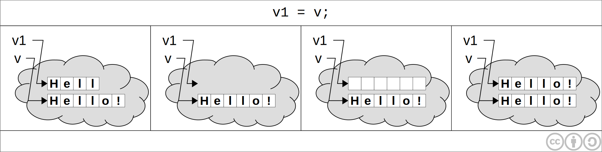

[doc vequality]: http://www.cplusplus.com/reference/vector/vector/operator=/


#### Как вектор управляет памятью

Вектор выделяет чуть больше памяти чем ему требуется для хранения элементов. 
Поэтому различают логическую длину (**size**) и фактическую длину (**capacity**).

```cpp
v.capacity();  // Получить фактическую длину
```

Как только **size** пытается превысить **capacity**, **capacity** увеличивается и происходит выделение дополнительной памяти.

```cpp
v.resize(n);	// Изменить размер (обрезать / дополнить нулями)
v.reserve(n);	// Увеличить вектор, чтобы можно было хранить n элементов
```

При добавлении элемента, если выполняется условие `size > cap` тогда capacity увеличивается в 2 раза: `v.reserve(size * 2)`.

Если в процессе работы программы становится ясно, что в дальнейшем размер вектора увеличиваться не будет, тогда можно урезать **capacity** вектора до его **size**.

```cpp
v.shrink_to_fit();      // C++11
vector<int>(v).swap(v); // C++98
```


## Классы и перегрузка операций

В языке С++ есть встроенные типы. Например

```cpp
int i;
double d;
```

При этом мы можем производить с ними привычные действия.

```cpp
d = 5.0; i = 3;
d = i * d;
```

При разработке языка Страуструп предложил идею, что все классы, должны быть аналогичны по возможностям встроенным типам.

**Отличие класса от структуры**, лишь в том, что в классе поля по-умолчанию *приватные*, а в структуре *публичные*.

#### Описание класса

Рассмотрим процесс создания класса на примере класса `Date`.
Описание самого класса необходимо помещать в `*.h` файл.

```cpp
/* date.h */

class Date
{
    private: // это слово писать не обязательно
        int y, m, d;
  
    public:
        // Конструктор класса
        Date(int d, int m, int y)
        {
          this->d = d;
          this->m = m;
          this->y = y;
        }
        
        void add_days(int n);
};
```


Все функции размещенные внутри класса автоматически помечаются модификатором `inline`.
 
Определение внешних функций класса осуществляется в `*.cpp` файлах.

```cpp
/* date.cpp */

#include "date.h"

// Определение некоторой функции вне интерфейса класса
void Date::add_days(int n)
{
  ...
}
```

При надлежащей реализации класса `Data`, в C++ будут возможный действия следующего рода:

```cpp
Data d(17, 10, 14), d1 = d;
cin >> d1;
Date d2(31, 12, 14);

d += 7;
d1 = d1 - 7;
int n = d2 - d;
if (d == d1)...
d++; ++d; d1--; --d1;
d2++;
cout << d << ' ' << d1
```

Как видим это код выглядит так, будто `Data` это встроенный тип.


### Перегрузка бинарной операции

Перегрузка операции это описание операции с тем же именем, но работающей с другими типами.

`@` - обозначение бинарной операции в рамках курса

Существует 2 способа

1.Как функцию-член

```cpp
a.operator@(b)
```

2.Как внешнюю функцию

```cpp
~operator@(a, b)
```

Реализовывать необходимо одно из двух. При попытке реализовать оба варианта компилятор выдаст ошибку.

```cpp
class Date
{

    ...

    void operator+=(int n)
    {
        add_days(n); // inline
    }
}
```

т.е. `d += 7;` ~ `d.operator+=(7);` ~ `d.add_days(7);`


### Передача объектов в функцию

Напомним, что в C++ передача параметров в функцию осуществляется по значению, то есть в функцию передается копия передаваемой переменной. Этот факт справедлив и для _очень больших_ объектов таких как `string` или `vector`. Чтобы не происходило полного копирования объектов, нужно передавать их по ссылке:

```cpp
void f(vector<int> &v);

void f(const string &s);   // Изменить строку не получится
```


<a id="lecture10" title="Лекция 10" class="toc-item"></a>
# Лекция 10

## Конструктор со списком инициализации

В лекции 9 рассматривался следующий пример конструктора [класса][lect9_cl_date] `Date`.

[lect9_cl_date]: 09.html#classes_and_operator_overloading

```cpp
Date(int d, int m, int y)
{
    this->d = d;
    this->m = m;
    this->y = y;
}
```

Данная реализация является упрощённой («как в Паскале»).
В C++ для инициализации полей в конструкторе используются
**списки инициализации**.

```cpp
class Date
{
    int d, m, y;
    
public:
    Date(int d, int m, int y) : d(d), m(m), y(y) {}
};
```

Здесь

> `d(d), m(m), y(y)` — список инициализации.

Конструкция `d(d)` означает `поле(аргумент конструктора)`.

Если список инициализации не используется (как в первой версии), то в случае
полей классовых типов (например, `string`) всё равно вначале будут вызваны их
конструкторы, а затем в теле конструктора класса значения полей будут перезаписаны
на основе аргументов конструктора. То есть выполняется двойная работа.

Для больших классов часто разносят описание и реализацию всех функций-членов для
улучшения обозримости класса, возможно оставляя определение
таких мелких объектов, как конструктор в данном примере.

## Перегрузка операций

Как было сказано на прошлой лекции, бинарные операции можно перегружать двумя
способами:

* как функцию-член класса,
* как внешнюю функцию.

При перегрузке бинарной операции, очень важно правильно ответить на вопрос:

> Как выбрать между функцией-членом и внешней функцией?

Ключевым моментом этого выбора является то, что функция-член имеет доступ к
закрытым полям класса. Для многих операций думать над этим не нужно, а нужно
знать стандартный подход, который является наиболее разумным в большинстве
случаев.

### Перегрузка операции сравнения на равенство

Рассмотрим перегрузку операции сравнения на равенство на примере класса `Date`
из лекции 9.

```cpp
class Date
{
    int d, m, y;

public:
    //bool operator==(Date d1, Date d2) типичная ошибка
    bool operator==(Date const & other)
    {
        return d == other.d &&
               m == other.m &&
               y == other.y;
    }
};
```

**Замечания.** Если операция бинарная, то у нее будет один аргумент (в случае,
когда операция определена функцией-членом).
Если класс этого аргумента совпадает с текущим классом, то у нас есть доступ к
закрытым полям объекта-аргумента.

Аргумент оператора правильнее передавать _по ссылке на константу_.
Это **общее правило C++**: сначала формальный параметр описывается
как ссылка на константу, затем, при необходимости, из объявления параметра
убирается `const`. В последнюю очередь стоит подумать о передаче объекта по
значению (это нужно довольно редко).

### Перегрузка операции вывода в поток (чтения из потока)

Должен ли `operator<<(>>)` быть функцией-членом?
Ответ: нет, он должен быть внешней функцией т.к `cout` — объект существующего
класса, в который мы не можем добавить перегрузку для вывода объекта нашего
нового класса.

Если `operator<<(>>)` должен быть внешней функцией, тогда как получить доступ к
полям класса `Date`?
Для решения это проблемы `operator<<` обычно объявляется **другом** класса:
в начале заголовка добавляется ключевое слово `friend`.

```cpp
/* date.h */
class Date
{
    int d, m, y;
public:
    // …
    
    friend
    ostream & operator<<(ostream & os, Date const & d);
};


/* date.cpp */
ostream & operator<<(ostream & os, Date const & d)
{
    os << d.d << '.' << d.m << '.' << d.y << '\n';
    return os;
}
```

Функция `operator<<` должна возвращать ссылку на полученный объект потока для
допустимости цепочек типа `cout << d1 << d2;`

Операция чтения из потока определяется аналогичным образом, только вместо `ostream` используется `istream`.

#### Более короткий вариант

Т.к. `operator<<` небольшой, то его лучше сделать `inline`. Перенесем реализацию
в заголовочный файл.

```cpp
/* date.h */
class Date {
    int d, m, y;
public:
    // …

    friend
    ostream & operator<<(ostream & os, Date const & d)
    {
        return os << d.d << '.' << d.m << '.' << d.y << '\n';
    }
};
```

Если друг класса определен прямо в классе, то он **остается внешней функцией** и
становится `inline`.

### Перегрузка арифметических операций

#### Канонический вид перегрузки арифметических операций

Пусть `@` ∈ {`+`, `-`, `*`, `/`}.
Обычно определяют пару функций: `operator@=`, `operator@`.
В таком случае `operator@=` определяется как функция-член, а `operator@` — как
внешняя функция.

Операция `@=` называется **присваивающей формой операции `@`**.

Рассмотрим перегрузку арифметических операций на примере класса `BigInteger`.

```cpp
class BigInteger {
    int data[1024];

public:
    BigIntiger & operator+=(BigInteger cons & other)
    {
        // Цикл по data: суммирование и перенос
        // Возвращаем ссылку на себя
        return *this;
    }
};

BigInteger operator+(BigInteger const & bi1, BigInteger const & bi2)
// функция не может возвращать ссылку, потому возвращает новый объект
{
    BigInteger res(bi1);  // копия bi1
    res += bi2;           // res хранит bi1 + bi2
    return res;
}
```

Так как ссылки на локальные переменные запрещены, а аргументы + должны остаться
неизменными, сумму они хранить не могут, то нам не на что возвращать ссылку и
мы возвращаем новый объект. При этом происходит копирование объекта из кадра
стека функции `operator+` в кадр стека вызывающей его функции, что может
иметь чувствительные накладные расходы.

Поскольку `@=` является `inline`, дополнительных расходов на её вызов не возникает.


<a id="lecture11" title="Лекция 11" class="toc-item"></a>
# Лекция 11 


## Перегрузка унарных операций

Для класса `Date` очень полезными будут операции `d++` и `++d`. Рассмотрим реализацию таких операторов.


### Префиксная унарная операция (@a `++a` `--a`) (общий случай)

Префиксная унарная операция может быть определена двумя способами:

1. В виде функции-члена: `@a ~ a.operator@()`.
2. В виде внешней функции: `@a ~ operator@(a)`.

Определим эту операцию для класса `Date`

```cpp
class Date
{
    …
    public:
    …
    // определение префиксного ++
    Date & operator++()
    {
        add_days(1);
        return *this;
    }
};
```


### Постфиксная унарная операция (a@ `a++` `a--`)

При перегрузке префиксной и постфиксной унарных операций встает вопрос, об интерпретации записи типа `operator@`.
В первых версиях языка префиксная и постфиксная операции определялись одинаково, но 1998 году для их разделения был введен фиктивный параметр типа `int`.

Постфиксная унарная операция также может быть определена двумя способами:

1. В виде функции-члена `a@ ~ a.operator@(int)`.
2. В виде внешней функции `a@ ~ operator@(a, int)`.

Рассмотрим ее реализацию для класса `Date`:

```cpp
class Date
{
    …
    public:
    …
    // определение постфиксного ++
    // d++ возвращает значение до увеличения, 
    // значит возвращать нужно копию, а не ссылку.
    Date operator++(int)
    {
        Date d = *this;
        add_days(1); // ~ ++(*this);
        return d;
    }
};
```

Как видим, из-за копирования всего объекта операция `d++` будет выполняется дольше, поэтому надо выбирать в пользу `++d`. 
Это верно для своих типов, но для встроенных типов компилятор производит оптимизацию. В результате записи `i++` и `++i`, например, для переменных типа `int`, равноценны.


## Перегрузка операции != 

Операция `!=` симметрична, поэтому предпочтительным выбором будет перегрузка оператора `operator!=` как внешней функции. Однако, для увеличения производительности, объявим функцию другом класса — таким образом она станет `inline`.

```cpp
class Date
{
    …
    public:
    …
    friend bool operator!=(const Date &d1, const Date &d2)
    {
        return !(d1==d2);
    }  
};
```

Как видим, использование ранее определенной операции `==` позволяет не обращаться к внутренним полям класса напрямую. Так как описанная функция является `inline`, то в результате будет произведена следующая замена.

`d1!=d2` ~ `!(d1==d2)` ~ `!(d1.d == d2.d && d1.m == d2.m && d1.y == d2.y)`


## Класс динамического массива

Попробуем реализовать аналог класса `vector`.

```cpp
template<typename T>
class myvector
{
    T* data;
    int sz;
    
  public:
    myvector(int size): sz(size)
    {
        data = new T[sz];
    }
    
    int size()
    {
        return sz;
    }
};
```


### Константные функции-члены

Теперь напишем процедуру, которая выведет на экран содержимое нашего вектора.

```cpp
void print(const myvector<int> &v)
{
    for(int i = 0 ; i < v.size(); i++)
    cout << v[i] << ' ';
}
```

Такой код не скомпилируется: ошибка произойдет из-за функции-члена `v.size()` так как эта функция, потенциально может изменить состояние объекта, в то время как формальный параметр `v` объявлен с модификатором `const`.

Для решения этой проблемы функцию `size()` надо определить как константный.

```cpp
int size() const
{
    return sz;
}
```
 

## Перегрузка операции []

Теперь рассмотрим перегрузку операции `operator[]` для того же класса `myvector`.

```cpp
template <typename T>
class myvector
{
    T* data;
    int sz;
    
  public:
    …
    T& operator[](int n)
    {
        if(n < 0 || n >= sz)
            throw n;
        return data[n];
    }
};
```

Так как `operator[]` ― `inline`, то будет произведена замена:

`v[i]` ~ `v.operator[](i)` ~ `v.data[i]`

При компиляции процедуры `print` вновь произойдет ошибка. На этот раз причиной будет функция `v[i]`. Для корректной компиляции в данном случае необходимо определить вторую функцию.

```cpp
T operator[](int n) const
{
	if(n < 0 || n >= sz)
		throw n;
	return data[n];
}
```


## Деструктор и его необходимость

Деструктор — коренная особенность C++

Рассмотрим такой случай:

```cpp
{
    myvector<int> v(100000);
    v[0] = v[99999];
    …
}
```

Внутри `v` создается массив в динамической памяти на 100000 элементов, а после работы с ним освобождения этого блока не происходит. Возникает утечка памяти. 
Для борьбы с утечками памяти в таких случаях в C++ был придуман деструктор.

Реализуем деструктор для класса `myvector`.

```cpp
template <typename T>
class myvector
{
    T* data;
    int sz;
    
  public:
    ~myvector()
    {
        delete[] data;
    }
};
```

Деструкторы всегда вызываются **неявно** в **определенный момент времени**. Для локальных объектов при выходе из блока, а для глобальных при завершении программы.

Принципиальное отличие этого подхода от сборщика мусора: сборщик мусора вызывается в недетерминированный момент времени, а деструкторы всегда вызываются в детерминированный момент времени, когда заканчивается время жизни объекта.


<a id="lecture12" title="Лекция 12" class="toc-item"></a>
# Лекция 12


## Конструктор копии

Рассмотрим следующую реализацию класса `myvector`:

```cpp
class myvector {
    int size;
    int * data;
    string name;

public:
    myvector(string const & name = "id1")
        : size(8), name(name)
    {
        data = new int [size];
        cout << name << " created\n";
    }

    ~myvector()
    {
        delete [] data;
        cout << name << " killed\n";
    }
};
```

Проверим работу нашего класса, выполнив следующий код в функции `main`:

```cpp
    myvector myv1;
    myvector myv2 = myv1;
```

В строке `myvector myv2 = myv1;` мы подразумеваем, что происходит
копирование объекта `myv1`, а в конце выполнения функции `main()` —
удаление двух объектов: `myv1` и `myv2`.

В действительности, при запуске программы происходит ошибка:

> id1 created<br>
> id1 killed<br>
> *** Error in `./main': double free or corruption (fasttop): …


Данная проблема возникает из-за того, что команда `myvector myv2 = myv1;`
выполняет копирование указателя `data` объекта `myv1` в `myv2`.
Таким образом в конце программы
одна и та же память освобождается дважды — в деструкторе каждого из объектов.

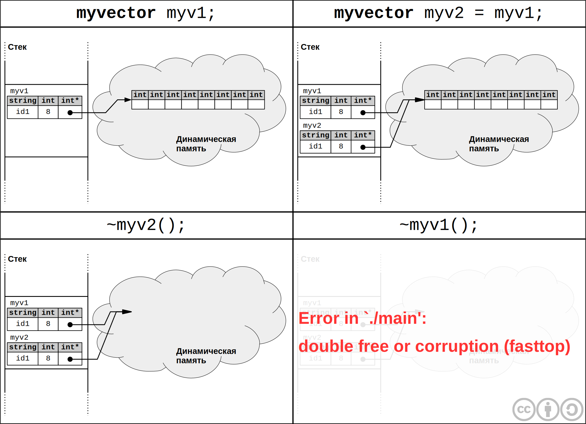

Для того, чтобы добиться корректного поведения при копировании, существует
так называемый **конструктор копии**. Это специальный конструктор, применяемый
для создания нового объекта как копии уже существующего.
Реализуем такой конструктор для класса `myvector`:

```cpp
myvector(myvector const & other): size(other.size), name(other.name)
{
    data = new int[size];
    copy(other.data, other.data + size, data);
    ++name[2];

    cout << "copy ctor from " << other.name << " to " << name << endl;
}
```

Теперь вывод программы выглядит следующим образом:

> id1 created<br>
> copy ctor from id1 to id2<br>
> id2 killed<br>
> id1 killed<br>

### Три случая, когда вызывается конструктор копий

1. Явное создание нового объекта-копии:

    ```cpp
    myvector myv2 = myv1`;
    ```

2. Вызов функции с передачей параметра **по значению**:

    ```cpp
    void f(myvector st) {/* … */}
    ```

3. Возврат объекта из функции по значению:

    ```cpp
    myvector g() {/* … */}
    ```

### Return Value Optimization

Рассмотрим следующий код.

```cpp
class myvector {
    …
public:
};

myvector g() { return myvector(); }

int main()
{
    myvector myv1 = g();
}
```

Вопрос: сколько будет вызвано конструкторов копий?
Ответ: здесь присутствуют случаи 1 и 3 вызова конструктора копий, а значит
должны создаваться две копии.

На самом деле, запуск данного примера покажет, что во время выполнения
программы не будет вызвано ни одного конструктора копий. Это результат
работы оптимизирующего компилятора. Заметим, что такая оптимизация может
существенно повлиять на поведение программы в случае,
когда конструктор копии содержит побочные эффекты (как в нашем примере:
вывод на консоль). Однако она производится
подавляющим большинством современных компиляторов _по умолчанию_,
потому что явно оговорена в стандарте языка.

Эта оптимизация носит название **Return Value Optimization (RVO)**.

Если специальными ключами компиляции запретить RVO, то будут вызвано
ровно два конструктора копии, как и ожидалось. Однако в реальных программах
просто стараются не помещать дополнительный код в
конструктор копии.

## Функции-члены, которые генерируются «молча»

Рассмотрим следующий (не очень полезный) класс.

```cpp
class Empty {};
```

На самом деле, такое описание класса **эквивалентно** следующему:

```cpp
class Empty{
public:
    Empty() {}

    Empty(Empty const &) {/* … */}

    Empty & operator=(Empty const &) {/* … */}

    ~Empty() {/* … */}
};
```

Здесь присутствуют 4 функции:

* `Empty()` ― конструктор без параметров,
* `Empty(Empty const &)` ― конструктор копий,
* `Empty & operator=(Empty const &)` ― операция копирующего присваивания,
* `~Empty()` ― деструктор.

Четыре перечисленные функции генерируются автоматически. Деструктор и
конструктор копии мы уже изучили, рассмотрим оставшиеся две.

## Конструктор по-умолчанию

Конструктор по-умолчанию — это конструктор без параметров, который
генерируется автоматически, только тогда, кода явно не определено ни одного
другого конструктора в классе (в том числе, конструктора копии).

Это свойство конструктора по-умолчанию может стать причиной неочевидных ошибок.
Рассмотрим класс `Student` и создание объекта этого класса:

```cpp
class Student
{
    string name;
}

main()
{
    Student s;
}
```

Этот код компилируется и работает (хотя не очень полезен). В `main`
работает конструктор по умолчанию. Добавим в класс `Student` конструктор с
инициализацией поля.

```cpp
class Student
{
    string name;
public:
    Student(string const & name) : name(name) {}
}
```

После этого `main` перестанет компилироваться, потому что исчезнет
конструктор по умолчанию. Аналогичная ошибка возникнет и при попытке объявить
массив объектов класса `Student`:

```cpp
main()
{
    Student students[3];
}
```

Это происходит потому, что при создании массива объектов компилятор
вставляет вызовы конструктора без параметров для каждого элемента
массива. Чтобы такой массив можно было создать, нужно самому добавить
в класс конструктор без параметров, либо проводить инициализацию явно:

```cpp
main()
{
    Student students[] = {Student("Vasya"), Student("Petya"),
                                Student("Sasha")};
}
```

## Операция копирующего присваивания

Сгенерированная компилятором реализация функции-члена `operator=` класса `myvector`
аналогична сгенерированному конструктору копии, который привёл нас к ошибке
двойного освобождения памяти.

```cpp
    myvector myv1;
    myvector myv2;
    myv2 = myv1;
```

Здесь произойдёт ещё и утечка памяти, так как старое значение указателя `data`
в объекте `myv2` потеряется. Значит, необходимо определить `operator=` самому.

```cpp
myvector & operator=(myvector const & other)
{
    if (this != &other) {   // Обязательное клише
        delete [] data;     // Нам потребуется новый размер поля data

        size = other.size;
        data = new int[size];
        copy(other.data, other.data + size, data);
        name = other.name;
        ++name[2];
    }

    return *this;
}
```

Данная реализация далека от идеала. В частности, могут возникнуть
проблемы при возникновении исключения в операции `new` (такое исключение это
не такая уж редкая ситуация): из-за `delete [] data` объект после
исключения в `new` останется в «полуразрушенном» состоянии. В C++
выделяют три уровня гарантий безопасности кода при возникновении исключений:

1. Базовая гарантия: при возникновении исключения не возникает утечек
   ресурсов, однако объекты могут находиться в непредсказуемом состоянии.

2. Сильная гарантия: если во время операции произошло исключение, то
   объект будет находиться в том же состоянии, что до начала операции.

3. Без исключений: в данном коде не может возникнуть исключений.

Приведённая версия `operator=` даёт лишь базовую гарантию. Достаточно
несложно изменить её на строгую. Заведём переменную `newdata` для
результата `new`, а операцию удаления `data` перенесём в конец функции.

```cpp
myvector & operator=(myvector const & other)
{
    if (this != &other) {
        size = other.size;
        int * newdata = new int[size];
        copy(other.data, other.data + size, data);
        name = other.name;
        ++name[2];

        delete [] data;
        data = newdata;
    }

    return *this;
}
```

### Идиома copy-and-swap

Идиома **copy-and-swap** позволяет разрабатывать устойчивые к исключениям операторы присваивания и сокращает количество кода в них ценой определения полезной
вспомогательной функции `swap` (обмен содержимого двух объектов).

Заметим, что реализация `operator=`, приведённая выше (обе версии),
выполняет действия, которые мы уже делали раньше в разных местах программы,
а именно в деструкторе и в конструкторе копии. Идиома **copy-and-swap**
опирается на это наблюдение и предполагает реализацию операции копирующего
присваивания с использованием конструктора копий. При этом требуется
вначале создать вспомогательную функцию-члена `swap(myvector & other)`,
для обмена содержимого текущего объекта с объектом `other`.

```cpp
class myvector {
    …
public:
    myvector & operator=(myvector other) // вызов КК (случай 2)!
    {
        this -> swap(other);

        cout << "copy assigment" << endl;
        return *this;
    }

    void swap(myvector & other)
    {
        std::swap(data, other.data);
        std::swap(size, other.size);
        std::swap(name, other.name);
    }
};
```


<a id="lecture13" title="Лекция 13" class="toc-item"></a>
# Лекция 13


## Метод resize() в классе myvector

```cpp
/* myvector.h */
#include <algorithm>
class myvector 
{
    int sz;
    T * data;
    …
    
public:
    void resize(int nsize)
    {
        T* ndata = new T[nsize];
        int n = (sz < nsize) ? sz : nsize;
        std::copy(data, data + n, ndata);
        delete[] data;
        data = ndata;
        sz = nsize;
    }
};
```


## Класс matrix

Матрица — вектор векторов. 

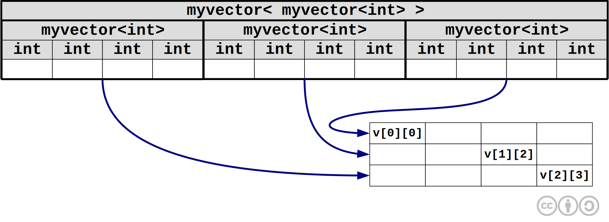

Допустим нам необходимо создать матрицу 3x4, тогда мы можем попробовать реализовать её следующим образом.

```cpp
/* main.cpp */
int main()
{
    myvector<myvector<int>> m(3);
    …  
}
```

Но так сделать не получится, потому что произойдёт ошибка компиляции: мы не определили конструктор по умолчанию. Необходимо добавить в класс `myvector` следующую строку.

```cpp
/* myvector.h */
class myvector 
{
    …
public:
    myvector(int size = 0);
};
```	

Теперь мы имеем 3 экземпляра класса `myvector` с размером 0. 
Чтобы увеличить размер всех векторов выполним для каждого из них `resize()`.

```cpp
/* main.cpp */
int main()
{
    …
    for(int i = 0; i < 3; i++)
        m[i].resize(4);
    m[1][2] = 777;
}
```

В данном случае значение элемента будет присваиваться по ссылке, поэтому передаваемый объект будет очень маленьким.

Рассмотрим, как данная матрица будет выглядеть в памяти.

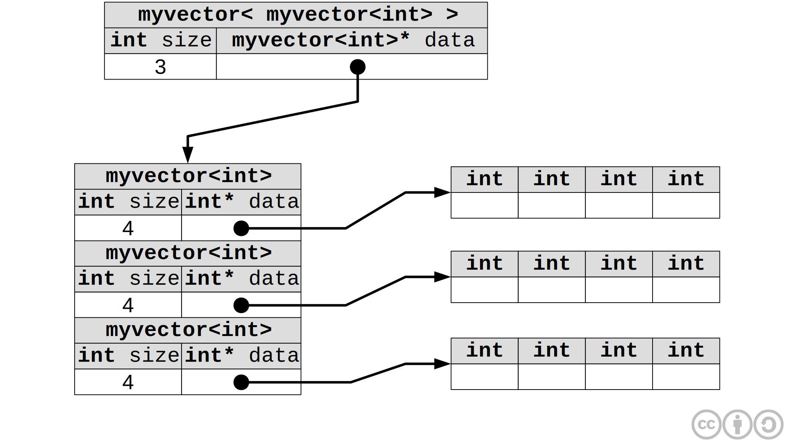

Будет ли данная динамическая память возвращена системе?

При выходе из блока `{ … m[1][2] = 777; }`, будет вызван деструктор `~m()` выполняющий `delete[] data`.

**Замечание**. Если `data` является массивом объектов некоторого класса, тогда до возврата своей памяти он вызывает деструкторы всех элементов этого массива. 
То есть сначала будут освобождены массивы `int`, а за тем массив `data`.


### Реализация класса matrix

```cpp
/* matrix.h */
template<typename T>
class matrix
{
    // Так сделать не получится 
    // myvector<myvector<T>> mdata(3);
    // Необходимо писать так
    myvector<myvector<T>> mdata;
    
public:
    // Вызывать конструктор mdata(m) в теле конструктора       
    // matrix уже поздно, а при объявлении еще рано, поэтому 
    // конструктор необходимо вызывать в списке инициализации
    matrix(int m, int n): mdata(m)
    {
        for(int i = 0; i < m; i++)
            mdata[i].resize(n);
    }
};
```

Если в списке инициализации мы забыли вызвать конструктор подобъекта являющегося объектом другого класса, то сгенерируется код вызывающий конструктор этого объекта по умолчанию.

Деструктор для данного класса писать не надо. 
Будет сгенерирован деструктор по умолчанию `~matrix() { }`.

**Правило.** Деструкторы всех подобъектов вызываются автоматически в эпилоге (перед закрытием фигурной скобки деструктора основного объекта).
Первым вызовется деструктор основного объекта. 
Деструкторы вызываются в порядке обратном порядку вызова конструкторов.
То есть последовательность вызовов конструкторов и деструкторов будет следующая.

1. Конструктор подобъекта
2. Конструктор основного объекта
3. Деструктор основного объекта
4. Деструктор подобъекта


### Операция доступа по индексу в matrix

`m[1, 2]` — в C++ так писать нельзя

`m[1][2]` — класс matrix не контролирует `[2]`

Поэтому лучше всего перегрузить `operator()`, тогда обращение по индексу будет выглядеть следующим образом `m(1, 2)`.

```cpp
/* matrix.h */
template<typename T>
class matrix
{
    …  
public:
    …
    T& operator()(int i, int j)
    {
        return mdata[i][j];
    }  
};
``` 

Так как `operator()` будет `inline`-функцией, то в результате вызов `m(1, 2)` будет преобразован следующим образом:
 
`m(1, 2)` ~ `m.mdata[1][2]` ~ `m.mdata.data[1].data[2]`


### Конструктор копий и operator= для класса matrix

Их писать не нужно. 
Они сгенерируются автоматически и будут работать правильно.
Конструктор копии и `operator=` необходимо писать вручную, только если мы в конструкторе данного класса выделяем динамическую память, а в деструкторе ее явно возвращаем. 
Если в классе есть подобъект, который берет на себя все функции, то определять эти члены не нужно.

Как работают автоматически сгенерированные конструктор копии и операция присваивания?

Автоматически сгенерированный конструктор копии вызывает конструкторы копий для всех своих полей. 
Автоматически сгенерированная операция присваивания вызывает операции присваивания для всех своих полей.

Посмотрим, какой будет сгенерирован конструктор копии.

```cpp
/* matrix.h */
template<typename T>
class matrix
{
    …
public:
    …
    matrix(const matrix<T> & mm): mdata(mm.mdata) {}
};
```

<a id="lecture14" title="Лекция 14" class="toc-item"></a>
# Лекция 14

## move-конструкторы и move-operator= (C++11)

Для продолжения наших рассуждений нам понадобится реализовать оператор `operator+` для класса `myvectror`(мы этого еще не сделали). Написать его не сложно:

```cpp
/* myvector.h */
template<typename T>
class myvectror
{
	…
public:
	friend
	myvector<T> operator+(const myvectror<T>& v1, const myvectror<T>& v2) 
	{
		myvector<T> v(v1.sz);
		for(int i = 0; i < v1.sz; i++)
			v[i] = v1[i] + v2[i]
		return v;
	}
}
```

<br><br>
Теперь предположим, что в процессе создания программы нам потребовалось написать следующий код:

```cpp
/* main.cpp */
myvector<int> v1(3), v2(3);
myvector<int> vv(v1 + v2);
```

В строке `myvector<int> vv(v1 + v2);` сначала создается временный объект при вычислении значения `v1 + v2`, а за тем вызывается конструктор копии `myvector(myvector const & other)` в который в качестве значения передается, созданный ранее, временный объект. В результате дважды происходит копирование одного и того же объекта.

Нам уже [известно](12.html#return_value_optimization), что на деле этого, скорее всего, не произойдет, благодаря, встроенной в большинство современных компиляторов, **Return Value Optimization**. Однако автоматическая оптимизация не всегда бывает эффективной, поэтому в стандарте **C++11** Бьярн Страуструп предложил вынести **RVO** на уровень языка. Для этого были введены **move**-конструктор и **move-operator=**.

Выражение `v1 + v2` из нашего примера называется **rvalue**. 
Мы не можем записать `v1 + v2 = v`, поэтому для того, чтобы как-то обращаться к **rvalue** используется ссылка на на него и обозначается с помощью двойного амперсанда **&&**, например `T && t`

Идея **move**-конструктора состоит в том, чтобы не удалять временный объект, а сделать в создаваемом объекте ссылки на поля временного объекта. Деструкторы для временных переменных вызываются в тот момент, когда эти переменные уже не используются для вычислений, поэтому необходимо так же позаботится о том, чтобы деструктор временного объекта вызывался при выходе из блока.

Реализация **move**-конструктора будет выглядеть следующим образом:

```cpp
class myvector
{
  …
public:
  myvector(myvector<T>&& v)
  {
    sz = v.sz;
    data = v.data;
	
	// Не позволит сразу удалить временный объект  
    v.data = nullptr;
  }

  // Так же переписываем деструктор
  ~myvector()
  {
    if(data != nullptr)
      delete[] data;
  }
}
```

Теперь в строке `myvector<int> vv(v1 + v2);` компилятор выберет **move**-конструктор вместо конструктора копии.

<br><br>

Аналогичная ситуация возникает при попытке выполнить такой код:

```cpp
/* main.cpp */
myvector<int> v1(3), v2(3);
myvector<int> vv;
vv = v1 + v2;
```

Здесь `v1 + v2` – это **rvalue**, а `vv` – **lvalue**.

В этих случаях используется **move-operator=**, который реализуется следующим образом:

```cpp
class myvector
{
	…
public:
	myvector<T>& operator=(myvector<T>&& v)
	{
		if(data != nullptr)
			delete[] data;		
		sz = v.sz;
		data = v.data;
		v.data = nullptr;		
		return *this;
	}
}
```

Таким образом **move**-конструктор и **move-operator=** решают вопрос о том, как уменьшить накладные расходы на копирование переменных.

Ввиду наличия большого количества стандартных классов использовать **move**-конструкторы приходится редко, однако знание такого механизма необходимо.


## Запрет генерации стандартных операторов

Как говорилось [ранее](12.html#member_funcs_generated_silently) существуют функции-члены, которые генерируются "молча", без явного описания. 
На практике, иногда, такие функции могут создать нежелательную функциональность, от которой нужно избавиться.

Для этих целей в C++ предусмотрен механизм запрета генерации стандартных конструкторов и функций. Рассмотрим его на примере класса `A`:

```cpp
class A
{
public:
	A(int i) {…}

	// Данная запись указывает на необходимость сгенерировать
	// конструктор по умолчанию
	A() = default;

	// Запретить генерацию конструктора по умолчанию
	A(const A&) = delete;

	// А так можно запретить генерацию operator=
	A& operator=(const A&) = delete; 
}  
```

## Класс frac дроби

Создадим новый класс `frac`, который реализует работу с рациональными дробями.

Экземпляр класса `frac` хранит число **f** в виде отношения **m/n**, где   **m**  и **n** целые числа типа `int`.

В данном классе необходимо реализовать преобразование объекта `frac` к типу `double`. То есть `frac f(1, 3);` будет эквивалентно `double d = 1/3.0;`

К примеру, если мы захотим создать функцию `Gauss`, которая решала бы уравнение вида **Ax = b** методом Гаусса, нам необходимо, чтобы эта функция могла работать с классом `frac`

```cpp
// T может быть равен double
// T может быть равен frac
template <typename T>
Gauss(const matrix<T> &A, const myvector<T> & b)
{
	…
}
```

Конструктор класса принимает в качестве аргументов значения чисел **m** и **n**, при этом логично хранить дроби в несократимом виде, поэтому разделим поля `m` и `n` на их наибольший общий делитель.

Реализация функции `operator+()` сводится к сложению двух отношений **m1/n1 + m2/n2**, при этом недопустимо прямое деление полей `m` и `n`, поэтому запишем формулу сложения дробей только с помощью операций сложения, умножения и целочисленного деления.


Важно помнить, что порядок операций для нас важен – результатом деления всегда должно быть целое число.

В итоге получим следующий код:

```cpp
class frac
{
	// n - натуральное
	// m - целое
	int m, n;
public:
	frac(int mm = 0, int nn = 1): m(mm), n(nn)
	{
		int nd = nod(m, n);
		m /= nd; n /= nd;
	}
	friend frac operator+(const frac f1, const frac f2)
	{
		int nd = nod(f1.n, f2.n);
		return frac(f2.n/nd*f1.m + f1.n/nd*f2.m, f1.n/nd*f2.n)
	}
	// реализовать operator*
}
```

<br><br>
Посмотрим на те возможности которые можно реализовать с помощью `frac`


## Конструктор преобразования

В реальной программе, работая с классом `frac`, мы хотим писать так: `frac f = 1;`.
То есть запись вида `f = 2;` должна быть эквивалентна `f = frac(2);`

Для решения этой задачи существует специальный конструктор, который называется конструктором преобразования.

Любой конструктор, который может быть вызван с одним параметром является конструктором преобразования и служит для неявного преобразования параметра к типу объекта данного класса. Это значит, что в нашем случае этот конструктор уже реализован. То есть запись `f = f1 + 3;` эквивалентна `f = f1 + frac(3);`, а `f = 2 * f2;` преобразуется к `f = frac(2) * f2;` ~ `f = frac(2,1) * f2;`

Однако обратим внимание на запись `frac(2) * f2`, здесь умножить целое число на дробь эффективнее, чем делать преобразование `frac(2,1)` и умножать дробь на дробь.

Поэтому, для ускорения работы перегрузим `operator*`:

```cpp
…
friend
frac operator*(int n, const frac &f)
{
	return frac(n * f.m, f.n);
}
…
```

#### Подвох в конструкторе с одним параметром (конструкторе преобразования)

Рассмотрим такой код:

```cpp
myvector<int> v(10), v1(10); // 10 нулей
v1 = v + 1;
```

Понятно, что делая запись `v1 = v + 1;` мы подразумеваем увеличение размера вектора на единицу и как следствие получение в `v1` нового вектора из 11 нулей.

На деле `v1 = v + 1;` эквивалентно `v1 = v + myvector<int>(10);`. То есть мы получим еще один вектор из 10 нулей.

Для того чтобы избежать данной ошибки, необходимо запретить преобразовывать **10** к `myvector<int>(10)`. Для этого существуют явные конструкторы преобразования.


### Явные конструкторы преобразования

Явный конструктор преобразования задается с помощью ключевого слова **explicit**, поэтому его еще называют **explicit**-конструктор.

```cpp
class myvector
{
	…
public:
	explicit myvector(int n) {}
}
```

Теперь компилятор запретит выражения типа `v1 = v + 1;`. Если же необходимо сложить два вектора, тогда надо явно указывать выполняемую операцию как `v1 = v + myvector<int>(10);`.


## Операции приведения типа

Часто при разработке новых классов появляется желание приводить уже существующие типы к новому, и наоборот. Попробуем написать следующий код:

```cpp
frac f = frac(2, 3);
double d = f;
```

В данном случае операция `double d = f` не сработает. Необходимо определить оператор приведения типа `operator double()`, для того, чтобы `f` была эквивалентна `double(f)`

```cpp
class frac
{
	int m, n;
public:
	operator double()
	{
		return m/(double)n;
	}
};
```

Теперь, в силу того, что `operator double()` является **inline**, запись `double d = f;` будет заменяться на `double d = f.m/(double)f.n;`

<a id="lecture15" title="Лекция 15" class="toc-item"></a>
# Лекция 15

## Перегрузка операций ввода-вывода

Займемся явной перегрузкой операции `operator<<()` для класса `frac`. В C++ в отличие от **.NET** перегружать нужно `operator<<()`, а не функцию преобразования класса к строке.

```cpp
class frac
{
	int m, n;
public:
	friend ostream& operator<<(ostream& os, const frac& f)
	{
		return os << '(' << f.m << ',' << f.n << ')';
	}
};
```

## Наследование

Наследование используется для повторного использования ранее написанного кода.

Рассмотрим уже знакомую нам иерархию:

[img](Person(к, д, кк, op=)<-Student(univ, marks-динамич))

Наличие динамически выделяемой памяти `int* marks` в классе Student создает большое количество проблем. Рассмотрим подробнее:

```cpp
class Student: public Person
{
	string univ;	// Университет
	int* marks;		// Оценки
public:
	Student(const string& name, int age, const string& u, int pl, int ip, int ml) : Person(name, age), univ(u)
	{
		marks = newint[3];
		marks[0] = pl;
		marks[1] = ip;
		marks[2] = ml;
	}
	
	~Student() {delete[] marks;}
};
``` 

Здесь `Person(name, age)` - это вызов конструктора предка.
Если не написать вызов Person(name, age), то произойдет вызов конструктора по умолчанию, а если его нет произойдет ошибка.

В деструкторе нам необходимо освободить только память занимемую `marks` - память выделенная для `univ` и `Person` будет освобожденна автоматический при вызове соответствующих деструкторов в эпилоге деструктора `~Student`.


## Порядок вызова конструкторов и деструкторов

1. Вызов конструктора базового класса
2. Вызов конструктора копии полей
3. Вызов конструктора основного объекта
4. Вызов деструктора базового класса
5. Вызов деструкторов полей
6. Вызов деструктора предка

Этот порядок не изменится если поменять местами элементы списка инициализации `Person(name, age)` и `univ(u)`

Все это происходит в эпилоге предка

Теперь нам необходимо написать конструктор копии класса `Student` 

```cpp
Student(const Student& s) : Person(s), univ(s.univ)
{
	marks = new int[3];
	std::copy(s.maks, s.marks + 3, marks);
}
```

Заметим, что `Person(s)` будет работать корректно благодаря **up-cast**

Операция присваивания будет реализована несколько сложнее:

```cpp
Student& operator=(const Student& s)
{
	if(&s != this)
	{
		delete[] marks;
		Person::operator=(s);
		marks = new int[3];
		std::copy(s.marks, s.marks + 3, marks);
		univ = s.univ;
	}
	returm *this;
};
```

Каждый ресурс под который выделяется память в конструкторе обычно стремятся обернуть объектом класса контролирующим этот ресурс, что упрощает код.

В `int* marks` выделение памяти происходит вручную, а для автоматического выделения памяти необходимо использовать `vector<int> marks`.

Теперь код становится значительно проще:

```cpp
class Student: public Person
{
	string univ;		// Университет
	vector<int> marks;	// Оценки
public:
	Student(const string& name, int age, const string& u, int pl, int ip, int ml) : Person(name, age), univ(u), marks(3)
	{
		marks[0] = pl;
		marks[1] = ip;
		marks[2] = ml;
	}
};
```

Деструктор теперь писать не надо так как автоматически сгенерируется `~Student()`, который вызовет `~marks`, `~uvin` и `~Person`.
Конструктор копии класса вызовет конструктор копии предка, а так же конструкторы копии полей класса.
**`operator=`** вызовет **`operator=`** предка и **`operator=`** для всех полей класса.
И все это будет происходить автоматически.

**Вывод.** Старайтесь все динамически выделяемые ресурсы оборачивать в отдельные классы


## Преобразование в иерархии "предок-потомок"

```cpp
Person p("Иванов", 20);
Student s("Петров", 19, 2, 9);

p = s;
s = p;
```

Здесь должно работать **правило:** переменной типа предок можно присвоить переменную типа потомок, но не наоборот.

[img]()

Однако в C++ **размерно-объектная модель**, поэтому вторая операция будет допустима.

|Иванов|20|<br>
|Петров|19|2|9|

При присваивании объекта произв класса переменной базового класса происходит обрезание полей произв класса до полей базового класса. То есть произойдет копирование только полей связанных с персоной.

Теперь рассмотрим преобразование типов при работе с указателями.

```cpp
Person* pp = &p;
Student* ss = &s;
```
[img](pp->||, ss->|||)

Возникает вопрос, возможны ли в данном случае следующие операции:

```cpp
pp = ss;
ss = pp;
```

Ответ: `pp = ss;` возможна, а `ss = pp;` нет.

В C++ работает следующее **правило**: Указателю на базовый класс можно присвоить адрес переменной произв класса, но не наоборот.

Таким образом, если мы напишем `Person& rp = s;`, тогда `rp` будет давать доступ только к двум полям.

Именно поэтому в конструкторе копии класса `Student` не возникало проблем с вызовом конструктора копии `Person(s)` в списке инициализации.