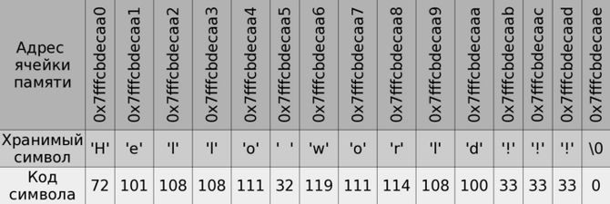

# Лекция 5

## Строки в стиле C

В языке С строки определяются как одномерный массив типа `char`.

```cpp
char str[] = "Hello world!!!";
```

Это строка из 14 символов, однако размер массива будет равен 15, так как
строки в C заканчиваются символом `\0` — нуль терминатор (нулевой байт:
байт, все биты которого равны 0). Иногда такие строки называют 
нуль-терминированными.



Недостаток такого подхода состоит в том, что для того чтобы узнать длину строки необходимо просканировать всю строку до конца, в поисках `\0` — это может занять много времени. 

При попытке стандартным образом ввести с консоли значение "Hello world!" в 
`str`, будет введено только "Hello" (до первого пробела). Чтобы этого не 
происходило можно использовать следующую запись:

```cpp
std::cin.getline(str, 14);  // 14 - количество вводимых символов
```

## Строки в стиле C++

В 1980 году появился класс `string`:

```cpp
string s1 = "Hello ";
string s2 = "world !!!";

s1.size();	// s1 - экземпляр класса, он помнит свою длину
s1[0];		// Индексация символов с нуля
s1 = s2;		// Строки можно присваивать друг другу
s1 += s2;	// Строки можно прибавлять друг другу 
s1 == s2;
s1 < s2;		// Строки можно сравнивать
```

Несмотря на то, что скорость работы C-строк немного выше чем у класса `string`, на прикладном уровне лучше использовать `string`. Однако системным программистам чаще приходится пользоваться `char*`.

### Ввод-вывод

```cpp
cout << s
cin >> s;
```

Если мы вводим "Hello world" в `s` будет храниться только "Hello", 
поэтому надо использовать `getline(cin, s);`.

### Как передавать в функции C- и C++-строки

#### С-строки
```cpp
void p(char s[])        // s передается по ссылке

void p(const char s[])  // const запрещает изменение s
```

#### С++-строки

```cpp
void p1(string &s)         // s можно менять
void p1(const string &s)   // s нельзя менять
```

## Двумерные массивы

Двумерные массивы определяются как массив массивов. Вот как будет 
выглядеть двумерный массив `int a[3][4]`.

|      |       |       |       |       |
|------|-------|-------|-------|-------|
|…     |a[][0] |a[][1] |a[][2] |a[][3] |
|a[0][]|a[0][0]|a[0][1]|a[0][2]|a[0][3]|
|a[1][]|a[1][0]|a[1][1]|a[1][2]|a[1][3]|
|a[2][]|a[2][0]|a[2][1]|a[2][2]|a[2][3]|


### Передача в функции двумерных массивов

```cpp
void print(int a[3][4], int m, int n) {
    for (int i = 0; i<n; i++)       
        ...
}
```

При передаче массива в функцию сохранится размер массива `a[][4]`: размер внешнего массива потеряется, а размер внутренних массивов сохранится.


## Определение типов в C++

Синонимы (псевдонимы) типов определяются с помощью `typedef`.

```cpp
typedef unsigned char byte;

typedef int Arr[3]; // Arr имя типа
typedef int Matr[3][4]; // Matr имя типа

// Теперь можно использоваать
void print(Matr a, int m, int n);
```

По сути объявление переменной `Matr a` будет заменено на `int a[3][4]`.

## Указатели и адреса

C++ унаследовал от C возможность работы на низком уровне.

Пусть мы имеем ячейку памяти `int i = 5`. Объявление `int *p;` вводит 
указатель, то есть переменную, которая может хранить адрес ячейки памяти с 
любым `int`, например, `i`.

```cpp
int i = 5;
int *p;
p = &i     // В указателе p хранится адрес ячейки памяти i
```

Можно использовать нулевой указатель, чтобы показать, что переменная-указатель 
пока не хранит никакого адреса. Для этого есть несколько способов.

```cpp
p = NULL;    // Так часто делали в C. Макрос NULL определён в <cstdlib>.
p = 0;       // Так советует Страуструп для C++98.
p = nullptr; // C++11
```

Если `*` пишется перед именем переменной, то эта переменная — указатель, 
а `*` — операция разыменования. Если `*` после типа переменной, то это объявление указателя (как во всех примерах выше).

```cpp
*p = 6 // Операция разыменования
```

### Указатели и ссылки
```cpp
//Указатели
int *p = &i;
*p = 6; 

// Ссылки
int &r = i // i и r - одна ячейка памяти
r = 6;
```

Если `&` пишется после названия типа, то это [ссылка](lecture_02.md#%D0%A1%D1%81%D1%8B%D0%BB%D0%BA%D0%B8). В противном случае, 
если он пишется перед именем переменной, то это адрес этой переменной. 
Ссылку можно трактовать, как указатель, который постоянно находится в 
разыменованном состоянии.

### Передача параметров в функции

По ссылке:

```cpp
void q(int &r) {
    r++;
}

int i = 5;
q(i);      // i == 6
```

По указателю:

```cpp
void q(int *p) {
    (*p)++;   // Скобочки важны!!!
} 

int i = 5;
q(&i);     // i == 6
```

Производительность в обоих случаях одинаковая.

### Указатель `void*`

```cpp
void *p;    // указатель на область памяти

int i = 5;
p = &i;

double d = 3.14;
p = &d;
```

т.е. `p` может хранить адрес любого объекта.

```cpp
void *p = &i

// Ошибка компиляции: нельзя разыменовать p
*p = 6

// Явное приведение к типу int* в стиле C
(int*)p = 6;    

// Использование представляет опасность если i не является int.
// Стиль C++ более явно заявляет об этой опасности:
*static_cast<int*>(p) = 6;       // но работает точно так же, как и выше

p = &d;
*static_cast<double*>(p) = 2.8;
```

Невозможно выполнить:

```cpp
int *pa;
double *pb;
pa = pb;
pb = pa;
```

Но можно с помощью явного приведения типов (в стиле C или в стиле C++,
но не `static_cast`, а `reinterpret_cast`).

### Указатели на структуры

```cpp
struct Person {
     string name;
    int age;
};

Person p {"Иванов", 19};
Person *pp = &p;
(*pp).age = 20;
pp -> age = 20; // операция доступа к полю в памяти
```

### Указатели и константность
```cpp
int i = 5;
int *p = &i;
const int *cp = &i; // Указатель на константу
cout << *cp;
*cp++;              // Ошибка компиляции
```

Это используется при передаче в функции
```cpp
void q(const int *p) {
  (*p)++;      // Ошибка компиляции
  cout << *p;
}
```

### Константные указатели
```cpp
int = 5;
const int n = 10;      // Обычная константа
int* const pc = &i;    // Константный указатель
pc = &j;               // Ошибка компиляции
(*pc)++;               // А здесь ошибки не будет
```

Другой пример. Нельзя обычному указателю присваивать адрес константы:

```cpp
const int n = 10;
int* pn = &n;    // Ошибка компиляции

const int *pn = &n;
*pn = 11;        // Ошибка компиляции
cout << *pn;
```

Однако возможно заставить компилятор снять константность:

```cpp
*const_cast<int*>(pn) = 11;
```

#### Константный указатель на константу

```cpp
const int* const pn = &n;
```
