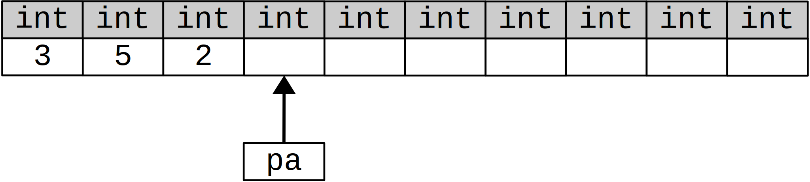
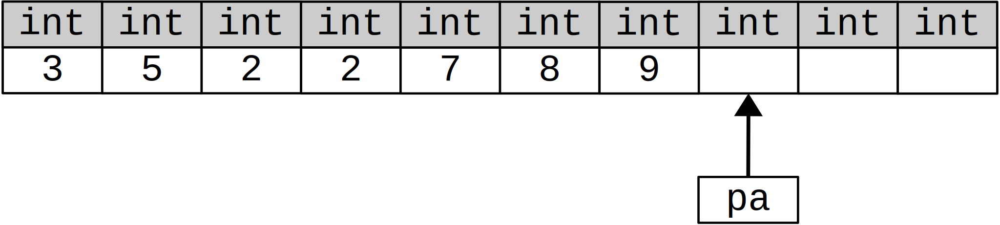

# Лекция 19


```cpp
vector<int> v {3, 5, 2};
list<int> l {2, 7, 8, 9}; 
int a[10];
auto pa = copy(v.begin(), v.end(), a);
```


```cpp
pa = copy(l.begin(), l.end(), pa);
```



Что будет, если в том контейнере куда мы копируем будет недостаточно места? Будет перезаписана чужая память из-за отсутствия контроля выхода за границу.

Если написать так:

```cpp
pa = copy(l.end(), l.begin(), pa);
```

Тогда `copy` от такой ошибки не застрахован, так же он не застрахован от ошибок в случае такого кода:

```cpp
pa = copy(l.end(), l.begin(), pa);
pa = copy(l.begin(), l1.end(), pa);
```

**Замечание.** Важно помнить, что элемент, на который указывает `end()` не принадлежит контейнеру, в отличии от `begin()`, который является итератором на первый элемент контейнера.


## Итератор списка

Мы хотим, что `copy` работал и для списка.

Для работы класса `list_iterator` нужен `listnode<T>`

Перегружая операции в `copy` мы изменяем работу `copy`. Сколько типов мы определим, столько будет создано `copy`

```cpp
template<typename T>
class list_iterator
{
	listnode<T> * cur;
public:
	list_iterator(listnode<T>* c):cur(c){}
	T& operator*() {eturn cur->data;}
	listierator<T>& operator++()
	{
		cur = cur->next;
		return *this;
	}
	template<typename S>
	friend bool operator!=(list_iterator<S>i1, list_iterator<S>i2)
	{
		return i1.cur != i2.cur;
	}
};
```

Теперь `copy` будет выглядеть следующим образом

```cpp
template<typename It, typename It1>
OutIt copy(InIt b, InIt e, OutIt b1)
{
	while(b.cur != e.cur)
		*b1 = b.cut->data;
	++b1;
	b.cur = b.cur->next;
	return b1;
}
```

## Основные контейнеры STL

* `vector<T>` - внутри это массив
* `list<T>` - внутри это двусвязный список
* `stack<T>` - различная реализация контейнера
* `qeueu<T>` - различная реализация контейнера
* `deque<T>` - это абстрактный тип данных с эффективными операциями доступа к началу и конку и достаточно эффективной операцией доступа по индексу

Ассоциативные контейнеры:

* `map<K, V>` - это аналог `SortedDicionary<K, V>` в **.NET**, по сути бинарное дерево поиска, то есть скорость поиска *log(n)*
* `set<K>` - множество, так же является бинарным деревом поиска 
* `multimap<K,V>` - `map` с повторяющимися значениями
* `multiset<K>` - `set` с повторяющимися ключами
* `unordered_map<K, V>` - хеш-таблица O(1)
* `unordered_set<K>` - хеш-таблица O(1)


## Конструкторы контейнеров

```cpp
vector<int> {2, 5, 1, 3};
list<int> {2, 5, 1, 3};
set<int> {2, 5, 1, 3};

// Инициализация диапазоном другого контейнера
int a[]{1, 2, 4, 5, 6};
vector<int> v1(a, a + 3);


v = v1;
l = l1; // присваивание возможно только для объектов одного типа

// Расширенное присваивание
v.assign(l.begin(), l.end());
// Перевыделение памяти


v1 < v2; // Лексикографическое сравнение
```


## Алгоритмы

### Алгоритм `for_each`
Работа:

```cpp
#include <algorithm>

template<typename InIt, typename Fun>
Fun for_each(InIt b, InIt e, Fun f)
{
	while(b != e)
	{
		f(*b);
		++b;
	}
	return f;
}
```

Использование:

```cpp
// Печать элемента контейнера
void print(int i)
{
	cout << i << " ";
}

list<int> l{1, 3, 5};
for_each(l.begin(), l.end(), print);
```

Тот же код можно написать с использованием лямбда выражений:

```cpp
for_each(l.begin(), l.end(), [](int i){cout << i << " ";});
```

В **STL** вызов `for_each` имеет следующий вид:

`Fun for_each(InIt first, InIt last, Fun f);`

Здесь `InIt` = `list<int>::iterator`, `Fun` = `void(*)(int)`


